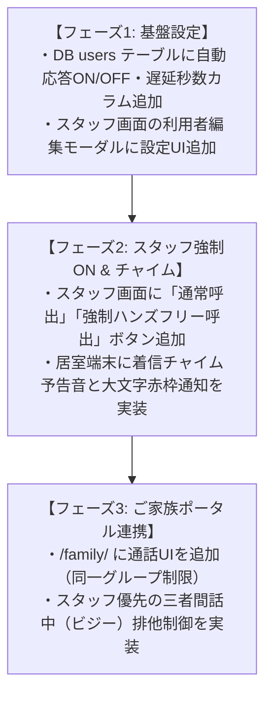

# 📅 Care-Link 開発日次最終進捗報告書 (2026-09-10)

> [!SUCCESS] **本日（2026-09-10）の全体達成サマリー**
> 本日は、ご家族見守りポータルの「絵手紙・ショート動画の保存機能」「保存先フルパス表示」を完全実装・実機検証完了したほか、インターホン機能の拡張方針（ご家族通話、ハンズフリー自動応答のサーバー設定化、強制ON調停）について課題抽出と実装ロードマップを策定いたしました。

---

## 📌 本日の主要実装・成果内容まとめ

### 1. 📥 デジタル絵手紙の保存機能の堅牢化
- **課題**: ブラウザの自動ダウンロード遮断ポリシーにより、ダウンロードフォルダにファイルが保存されない現象が発生。
- **改善**:
  - ボタンをブラウザ直結のネイティブダウンロードリンク（`<a download>`）に刷新。
  - バックエンド（FastAPI）に `Content-Disposition: attachment` を付与する配信エンドポイント（`/api/family/download_raw_postcard`）を新設。
  - 端末側（`~/ダウンロード`）への保存が確実に動作することを確認。

### 2. 🎬 思い出ショート動画のダウンロード保存機能の新設
- **新設**: 動画コントロールバーに「**📥 動画を保存**」ボタンを追加。
- **MediaRecorder API連携**:
  - ボタンを押すと、その週の4枚のスライドショー（Ken Burnsズーム・パーティクル・日付字幕）が自動録画開始。
  - ボタン上に `⏳ 録画中 (45%)...` のリアルタイム進捗を表示。
  - 録画終了後、`care_link_movie_山田太郎_2026-09-07.webm`（または `.mp4`）として自動ダウンロード。

### 3. 📂 保存時のファイルフルパス表示＆ワンクリックコピー
- 絵手紙・動画の保存完了時に、画面右下に専用通知カードを表示。
- **保存先フルパスの完全表示**:
  ```text
  /home/k3and4/ダウンロード/care_link_postcard_山田 太郎_autumn_令和8年9月10日.jpg
  ```
- **「📋 フルパスをコピー」ボタン**: ワンクリックでクリップボードにコピーされ、ファイルマネージャーやターミナルで即座にアクセス可能。
- 関連関数のスコープを整理し、初期ロード時・アーカイブ切り替え時の連動を完全最適化。

### 4. 📞 インターホン機能の整理・課題抽出と合意
- 現行の Pattern A（スタッフ⇔居室間 双方向WebSocket通話、2秒自動応答）のアーキテクチャを整理。
- **ご家族利用・強制ON・サーバー設定化**に伴う課題（盗聴リスク・入室チャイム・トンネル遅延・三者競合排他制御）を抽出し、以下の3フェーズでの実装順序を決定・合意。

---

## 🗺️ 次回再開時の実装ロードマップ（インターホン機能拡張）



### 次回着手予定の作業（フェーズ1）:
1. **データベース改修**:
   - `backend/database.py` の `users` テーブルに以下の設定カラムを追加：
     - `intercom_auto_answer` (INTEGER / 1: 有効, 0: 無効)
     - `intercom_auto_delay` (INTEGER / 自動受話までの秒数: デフォルト2秒)
     - `allow_force_answer_staff` (INTEGER / スタッフ強制受話許可: 1)
     - `allow_force_answer_family` (INTEGER / 家族強制受話許可: 0または1)
2. **スタッフ管理画面（/staff/）の改修**:
   - 利用者編集フォームに「ハンズフリー自動応答」のON/OFFトグルおよび秒数設定を追加。
3. **利用者端末（/user/）の受話判定**:
   - 着信時にサーバー側の設定値を見て、自動受話（ハンズフリー）するか通常呼び出し（画面タップ待ち）かを切り替え。

---

## 💻 変更・更新ファイル一覧

- `backend/main.py`: `download_raw_postcard` および `download_postcard` の専用ダウンロードAPIを追加。
- `frontend/family/index.html`: ネイティブダウンロードリンク、動画保存ボタン、キャッシュバスター更新。
- `frontend/family/style.css`: `.btn-postcard-action`（インラインフレックス化）、`.btn-movie-save`（緑色ボタンスタイル）を追加。
- `frontend/family/app.js`: `showFileSavedNotice`（フルパス表示＆コピー）、`updatePostcardDownloadLink`、`recordAndDownloadMovie`（MediaRecorder録画）の実装とスコープ整理。

---

## 🌐 次回再開時のアクセス・確認用URL
- **ご家族見守りポータル**: [http://localhost:8000/family/](http://localhost:8000/family/)
- **スタッフ管理ダッシュボード**: [http://localhost:8000/staff/](http://localhost:8000/staff/)
- **利用者対話端末**: [http://localhost:8000/user/](http://localhost:8000/user/)

本日も大変お疲れ様でした！次回はいつでもお声がけいただければ、フェーズ1（サーバー設定・DB改修）からスムーズに再開いたします。
