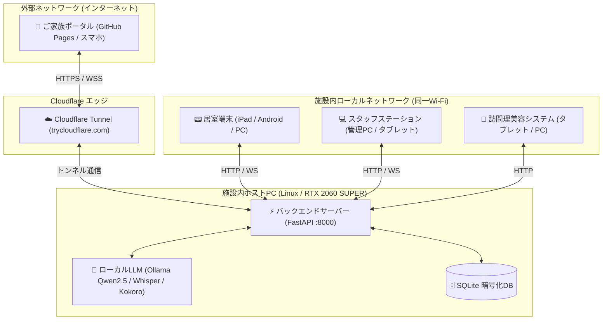
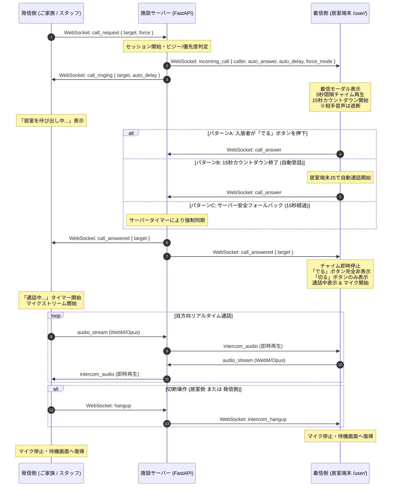
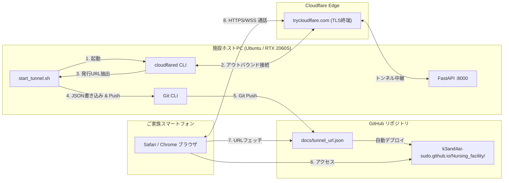

# ケア・リンク (Care-Link) インターホン仕様 & トンネル・GitHub連携ネットワーク構成書

**作成日**: 2026年9月11日  
**対象システム**: 施設統合AI見守りシステム「ケア・リンク (Care-Link)」  
**用途**: Obsidianナレッジベース用 技術仕様・アーキテクチャ解説書  

---

## 1. システム全体概要と主要画面

本システムは、介護施設内のローカルPCで稼働するバックエンドサーバーを中心に、以下の4つの主要フロントエンド画面と外部通信機能で構成されています。



---

## 2. 接続URL一覧仕様

各画面へアクセスするためのURL体系です。利用場所（外部、施設内Wi-Fi、開発PC）に応じて最適なアクセス方法が用意されています。

| システム画面名 | 外部アクセス (ご家族等) | 施設内Wi-Fi (タブレット等) | 同一PC内 (開発・デバッグ) | 備考・用途 |
| :--- | :--- | :--- | :--- | :--- |
| **ご家族見守りポータル** | `https://k3and4ai-sudo.github.io/Nursing_facility/` | `http://192.168.0.10:8000/family/` | `http://localhost:8000/family/` | トンネル経由で施設PCと自動接続 |
| **居室端末クライアント** | - *(施設内限定)* | `http://192.168.0.10:8000/user/` | `http://localhost:8000/user/` | 入居者用全画面レスポンシブUI |
| **スタッフステーション** | - *(施設内限定)* | `http://192.168.0.10:8000/staff/` | `http://localhost:8000/staff/` | 管理者ダッシュボード・呼出操作 |
| **訪問理美容予約システム**| - *(施設内限定)* | `http://192.168.0.10:8000/barber/` | `http://localhost:8000/barber/` | 予約台帳・施術カルテ・報告 |

> [!NOTE]
> 施設内Wi-FiのIPアドレス（`192.168.0.10`）はホストPCのプライベートIPです。ルーター環境に合わせて適宜読み替えます。

---

## 3. インターホン機能 詳細仕様

### 3.1 機能概要
ご家族ポータルまたはスタッフステーションから、居室端末（入居者様タブレット）へリアルタイム音声通話を発信する機能です。双方向の超低遅延音声ストリーミング（WebM/Opus スライシング方式）を実現しています。

### 3.2 呼出・受話・通話状態の遷移フロー



### 3.3 インターホン詳細設計ルール

1. **受話前音声遮断（プライバシー保護）**:
   - 居室側で「でる」ボタンが押されるか、設定されたカウントダウンがゼロになるまでは、**発信側の音声パケットを受信しても居室スピーカーから再生しないガード**を実装。
   - 入居者が心の準備をする前の不用意な音声漏れを完全に防止。

2. **5秒間隔のコール音（チャイム）ループ**:
   - 着信した瞬間に1回目のチャイムを即時再生。
   - ご家族からの着信: 心温まる和音チャイム「ピン・ポン・パン」（523Hz ➔ 659Hz ➔ 784Hz）。
   - スタッフからの着信: 明瞭な玄関チャイム「ピン・ポーン」（784Hz ➔ 659Hz）。
   - 緊急呼出（force）: アラート音＋高音チャイム（即時自動接続）。
   - **呼出中（相手が出るまで）は 5秒間隔でチャイムを繰り返し再生**。
   - 通話開始または切断の瞬間にタイマーを破棄し、チャイム音を即座に停止。

3. **自動受話カウントダウン時間の設定**:
   - **デフォルト時間: 15秒**（以前の10秒から入居者の応答余裕を考慮して延長）。
   - スタッフステーションの「利用者編集」画面にて、入居者ごとに `0秒〜60秒` の範囲で個別設定が可能。
   - `0秒` に設定した場合は手動応答専用（「でる」を押すまで自動接続しない）。

4. **通話開始後のUI切り替え（「でる」ボタン消去）**:
   - 通話が始まった瞬間に、CSS（`.call-card.in-call #answer-btn { display: none !important; }`）および JavaScript の両面で「でる」ボタンを完全に消去。
   - 画面には大きな赤い「切る」ボタンのみを残し、認知症高齢者でも迷わず切断できるように配慮。

5. **スタッフ緊急割り込み（優先度制御）**:
   - ご家族が入居者とインターホン通話中であっても、スタッフステーションから緊急呼出が入った場合、システムは自動的にご家族の通話を安全に切断（「スタッフ対応のため通話を終了しました」と通知）し、スタッフの通話へ最優先で切り替え。

---

## 4. トンネル接続構成 & GitHub Pages 連携仕様

外出先のご家族がスマートフォン等から施設内ローカルPCに安全に接続するためのネットワーク構成です。ポート開放や固定グローバルIPの契約を必要とせず、完全無料でセキュアな暗号化通信を実現しています。



### 4.1 起動自動化スクリプト (`start_tunnel.sh`) の動作

```bash
#!/bin/bash
# start_tunnel.sh のコアロジック
cloudflared tunnel --url http://localhost:8000 > tunnel.log 2>&1 &
# ログから https://xxx.trycloudflare.com を正規表現抽出
TUNNEL_URL=$(grep -o 'https://[-a-z0-9.]*\.trycloudflare\.com' tunnel.log | head -n 1)

# docs/tunnel_url.json へ書き込み
echo "{\"tunnel_url\": \"$TUNNEL_URL\", \"updated_at\": \"$(date -Iseconds)\"}" > docs/tunnel_url.json

# 自動 Git Commit & Push
git add docs/tunnel_url.json
git commit -m "chore(tunnel): auto-update cloudflare tunnel url to $TUNNEL_URL"
git push origin main
```

### 4.2 ご家族ポータル側の自動URL解決ロジック

1. ご家族が `https://k3and4ai-sudo.github.io/Nursing_facility/` を開く。
2. ポータルの JavaScript が起動時に `docs/tunnel_url.json?t=<キャッシュバスター>` をフェッチ。
3. 取得した `tunnel_url`（例: `https://xxx.trycloudflare.com`）を内部APIクライアントおよび WebSocketクライアント（`wss://xxx.trycloudflare.com/ws/family/{user_code}`）の接続先として自動設定。
4. これにより、トンネルのURLがPC再起動等で毎回変動しても、**ご家族側は常に同一のGitHub Pagesブックマークを開くだけで接続可能**。

### 4.3 施設サーバー起動状態のリアルタイム診断

ご家族ポータル画面上部には、施設PCの通電・稼働状態を判定するステータスバッジが設置されています。

- **🟢 施設サーバー稼働中**: 施設PCおよび FastAPI が正常に通信可能。
- **🔴 施設サーバー停止中**: 施設PCの電源がオフ、またはトンネル未接続。「施設スタッフの起動をお待ちください」と案内。
- **診断間隔**: 20秒ごとの自動ヘルスチェック（`/api/health` へのPing）により、リアルタイムに状態を反映。

---

## 5. セキュリティ仕様

1. **トランスポート層暗号化**:
   - Cloudflare エッジからホストPC間、およびクライアント端末間はすべて **TLS 1.3 / HTTPS / WSS** で保護。
2. **データベース暗号化 (AES-256-GCM)**:
   - 入居者の氏名、特記事項、AI会話記録、ケア日誌は SQLite 内に平文では保存されず、256ビット暗号化キーを用いて暗号化。
3. **グループ境界セキュリティ**:
   - ご家族アカウントは `group_id` に厳格に紐付けられ、許可されていない他の入居者の情報取得やインターホン発信はサーバー側で `403 Forbidden` として遮断。

---

## 6. 保守・運用コマンドリファレンス

### サーバー & トンネルの手動起動
```bash
# 1. 仮想環境のアクティベート
source .venv/bin/activate

# 2. バックエンドサーバー起動 (ホスト 0.0.0.0 / ポート 8000)
uvicorn backend.main:app --host 0.0.0.0 --port 8000 --reload

# 3. トンネル自動起動 & GitHub URL同期 (別ターミナル)
./start_tunnel.sh
```

### データベース手動マイグレーション確認
```bash
python3 -c "import backend.database as db; db.db_init(); print('DB OK')"
```
