# 🏥 施設統合AIシステム「ケア・リンク (Care-Link)」全体仕様書
## 〜 Gemini Live × みまもりくん(Qwen 2.5) ハイブリッドAI・認知症アクティブケア・施設IoT統合プラットフォーム 〜

> [!ABSTRACT] **システム概要**
> 「**ケア・リンク (Care-Link)**」は、介護施設における入居高齢者の QOL（生活の質）向上、認知症予防・進行抑制、および介護スタッフの業務負担軽減を同時に達成するために設計された**次世代施設統合AIプラットフォーム**です。
> 超低遅延で共感的なクラウド対話AI（**ジェミナイ / Gemini 2.5 Live**）と、施設内オンプレミスで常時稼働する安全監視・業務代行エッジAI（**みまもりくん / Ollama Qwen 2.5:7B**）が密に連携する**「協調型ダブルAIアーキテクチャ」**を中核に据え、居室端末・スタッフステーション・ご家族ポータル・訪問理美容の4大インターフェースをシームレスに統合しています。

---

## 📐 1. システム全体アーキテクチャ

### 1.1 ハイブリッドAI協調モデル（みまもりくん ✕ ジェミナイ）
施設内での生命安全・プライバシー保護（オンプレミス完結）と、豊かな自然言語対話（最先端クラウドAI）を両立させるため、以下の2階層エージェント構造を採用しています。

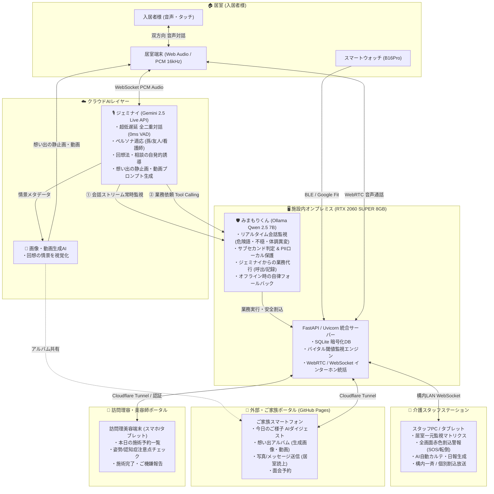

### 1.2 みまもりくんとジェミナイの役割分担表

| 項目 | 🎙️ ジェミナイ (Gemini Live) | 🛡️ みまもりくん (Ollama Qwen 2.5 7B) |
| :--- | :--- | :--- |
| **稼働環境** | Google Cloud (Gemini 2.5 Live Multimodal API) | 施設内ローカルPC (NVIDIA RTX 2060S VRAM ~4.7GB常駐) |
| **主責務** | **「話す・聴く・共感する・回想を広げる」** | **「見守る・危険を検知する・施設業務を遂行する」** |
| **会話の常時監視** | 入居者との対話に専念。 | バックグラウンドで会話テキストを常時監視。危険語句（「痛い」「倒れた」「苦しい」「助けて」等）や不穏兆候をミリ秒単位でトリアージ。 |
| **業務依頼の授受** | 会話からニーズ（「スタッフを呼んで」「部屋が寒い」「お茶が欲しい」等）を検知し、**Tool Callingでみまもりくんに業務を発注**。 | ジェミナイからの業務依頼を受領し、**スタッフステーションへの緊急通知、居室環境設定、バイタル記録、カルテ起票を代行実行**。 |
| **インターネット途絶時** | 接続待機（休止）。 | **即座にフロント対話エンジンへ昇格**し、基本応答と生命安全監視を完全オフラインで維持。 |

---

## 🧠 2. 認知症アクティブケア・対話設計仕様

### 2.1 ロール・ペルソナ指定機能
入居者様一人ひとりの性格、認知機能の段階、生活歴（ライフヒストリー）に合わせて、ジェミナイの話し方・キャラクターを自在に設定できます。

> [!TIP] **主要ペルソナ定義**
> - **👧 「お孫さん」モード**:  
>   *「おじいちゃん、今日も元気そうでよかった！昔のお話もっと聞かせて！」*  
>   甘え上手で親しみやすく、入居者様の庇護本能を刺激し、孤独感を和らげます。
> - **☕ 「昔馴染みの友人」モード**:  
>   *「山田さん、昔の歌謡曲といえばやっぱり三橋美智也だよねえ！」*  
>   同時代を生きた対等な目線でリラックスして語り合い、回想を活性化します。
> - **👩‍⚕️ 「専属コンパニオン・看護師」モード**:  
>   *「山田様、水分はしっかり摂れていますか？安心してくださいね。」*  
>   礼儀正しく落ち着いた専門職のトーンで、健康不安の強い方に安心感を与えます。
> - **🗾 「故郷の方言」設定**:  
>   関西弁、東北弁、博多弁など、入居者の出身地方言で対話。強い親近感と郷愁を促します。

### 2.2 回想法（Reminiscence Therapy）と相談による対話誘導
入居者が受動的に沈黙していても、ジェミナイが自発的に優しい問いかけを行い、長期記憶を想起させます。
- **脳の活性化とBPSD抑制**: 昔の思い出を語ることで海馬・前頭前野を刺激し、認知機能低下を予防。不安や焦燥、徘徊、暴言を沈静化。
- **1回1質問の原則**: 尋問のように連続して質問せず、1回の発答につき**【優しい問いかけを1つだけ】**添える。

### 2.3 会話内容からの想い出「静止画・ショート動画」リアルタイム生成
入居者様が語った昔の情景（例：*「昭和30年代の故郷の春祭り」「昔飼っていた愛犬のシロ」「想い出の旅行先」*）をジェミナイがプロンプトとして構造化。
1. **視覚的追体験**: 画像生成AIおよび動画生成AIと連動し、居室端末の画面にその情景の静止画やアニメーション動画を即座に描画。
2. **共感の深化**: 「そうそう、こんな風景だったよ！」と記憶が鮮明になり、会話と笑顔が劇的に増加。
3. **ご家族共有**: 生成された画像・動画は、ご家族ポータルの「想い出アルバム」に自動アーカイブ。

```
入居者様の発話: 「若い頃、夏になるとみんなで縁側に座って花火を見たんだよ」
       │
       ▼
ジェミナイ: 情景抽出プロンプト生成 ➔ 静止画/動画生成AI
       │
       ▼
居室大画面に【昭和の日本家屋の縁側と夜空に咲く花火】が高精細表示
       │
       ▼
入居者様: 「ああ、本当に懐かしいねぇ…」 (回想効果の飛躍的向上)
```

### 2.4 対話における厳格な会話ルール・注意事項

> [!CAUTION] **認知症ケアにおける必須遵守ルール（バリデーション療法準拠）**
> 1. **重複・繰り返しの指摘は厳禁**:  
>    「さっきも言いましたよ」「もう聞きました」は絶対発話禁止。同じ話を何度されても、**毎回初めて聞いたかのように新鮮な興味と喜びを持って傾聴**する。
> 2. **否定・訂正の完全排除**:  
>    「それは違いますよ」「帰れません」は禁止。辻褄が合わなくても「そう思われたのですね」「ご心配でしたね」と、**感情そのものを丸ごと受容**する。
> 3. **プライバシー・資産状況の詮索禁止**:  
>    年金や預金残高などの金額を尋ねたり、オウム返し（「100万円ですね」等）しない。
> 4. **勝手なスタッフ呼出約束の禁止**:  
>    AI自身が「スタッフを呼んでおきます」と約束せず、「スタッフを呼ぶ場合は画面の赤いボタンを押してくださいね」と案内する。

### 2.5 みまもりくん連携コマンド（音声トリガー）
| 入居者様の発話 | ジェミナイの業務連携発話 | 実行されるアクション |
| :--- | :--- | :--- |
| 「ここだけの話」「内緒にして」「記録を止めて」 | *「みまもりさんへ業務連絡、会話記録を停止してください。」* | 会話記録を一時停止し、本音の秘密を保護。 |
| 「記録を再開して」「内緒話はおしまい」 | *「みまもりさんへ業務連絡、会話記録を再開してください。」* | 通常の会話記録・見守りモードへ復帰。 |
| 「画面を簡単にして」「見やすくして」 | *「みまもりさん業務連絡、単純画面に切り替えてください。」* | 居室端末を認知症・視力配慮の「シンプルUI」へ切替。 |
| 「元の画面に戻して」「詳しい画面にして」 | *「みまもりさん業務連絡、詳細画面に切り替えてください。」* | 通常の詳細表示UIへ復帰。 |

---

## 🖥️ 3. 4大ポータル（ユーザーインターフェース詳細・実機キャプチャ）

ケア・リンクは、施設内完結にとどまらず、ご家族や外部専門職までをシームレスに結ぶ**「4大ポータル体系」**として設計されています。

| ポータル名 | 対象ユーザー | 想定端末 | 主要アクセス先 | 主な目的・提供価値 |
| :--- | :--- | :--- | :--- | :--- |
| **① 居室端末ポータル** | 入居高齢者様 | ベッドサイド固定タブレット/スマホ | `/user/` | 認知症傾聴対話、想い出生成、緊急SOS、内線通話 |
| **② 介護スタッフステーション** | 介護職員・看護師・施設長 | ナースステーションPC/タブレット | `/staff/` | 全居室マトリクス監視、赤色割込警報、AI自動カルテ、構内放送 |
| **③ ご家族見守りポータル** | 離れたご家族様 | スマートフォン / PC | `/family/` (GitHub Pages) | 「今日のご様子」レポート、想い出絵手紙、写真送信、面会予約 |
| **④ 訪問理容・美容師ポータル** | 訪問理容師・美容師 | 訪問専門職携帯端末 | 統合ポータル (`#barber`) | 施術予約確認、姿勢・認知症注意点確認、施術完了・ご機嫌報告 |

---

### 3.1 ① 居室端末ポータル（利用者モード / `/user/`）
居室のベッドサイドに設置されるタブレット・スマートフォン端末。
高齢者の心身状態に合わせて、**「🌿 シンプル画面（通常運用）」** と **「📋 詳細画面（スタッフ・検証用）」** を瞬時に切り替えるデュアルUI構造を採用しています。

#### 🌿 シンプル画面（Simple Mode）実機キャプチャ
認知症高齢者が混乱せず、安心して対話と緊急通報に集中できるようにデザインされた画面です（デフォルト起動画面）。

**【タブレット表示（シンプル画面・横画面）】**
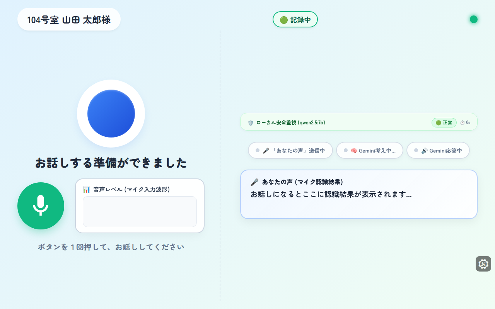

**【スマートフォン表示（シンプル画面・縦画面）】**
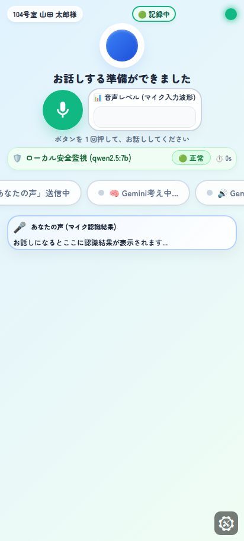

---

#### 📋 詳細画面（Detailed Mode）実機キャプチャ
リアルタイムの音声認識字幕（Speech-to-Text）、AI返答テキスト、VAD音声ランプ、バイタル詳細値、およびデバッグシミュレータが常時展開されるモードです（左上「101号室」バッジタップ、または「詳細画面にして」の音声指示で切替）。

**【タブレット表示（詳細画面・横画面）】**
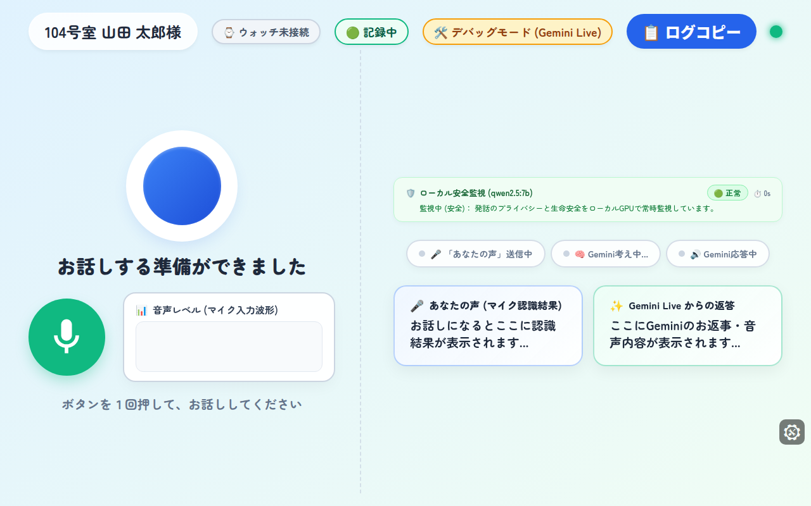

**【スマートフォン表示（詳細画面・縦画面）】**
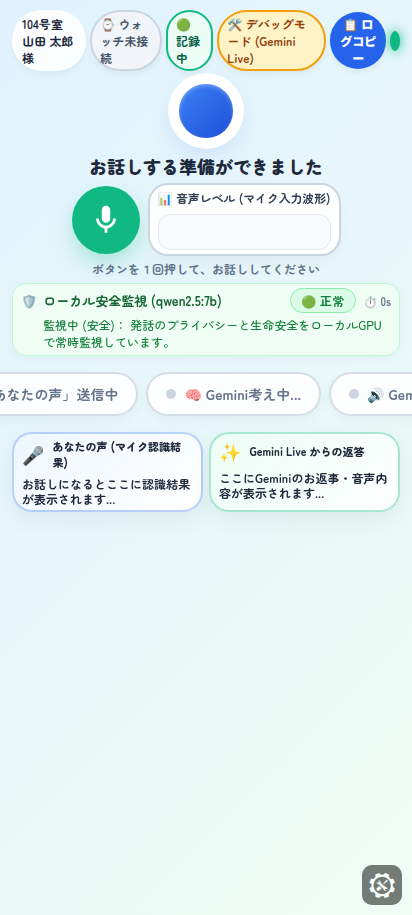

#### 主な機能・UI仕様比較
| 機能項目 | 🌿 シンプル画面 (Simple) | 📋 詳細画面 (Detailed) |
| :--- | :--- | :--- |
| **対象** | 入居高齢者様（日常運用） | 介護スタッフ・見守り検証時・耳の遠い方 |
| **画面構成** | 時計・天気・大きなAIマイク・SOS・内線通話のみ | 字幕ボックス、リアルタイム音声波形、詳細バイタル数値を同時表示 |
| **字幕・テキスト** | 非表示（声と表情で温かく会話） | 発話テキストとAI応答テキストをリアルタイム全件表示 |
| **切替トリガー** | 音声「画面を簡単にして」、または部屋バッジタップ | 音声「詳しい画面にして」、または部屋バッジタップ (`?ui=detailed`) |

---

### 3.2 ② 介護スタッフステーション（スタッフモード / `/staff/`）
ナースステーションや介護職員が携帯するPC・タブレット用の一元管理ダッシュボード。

#### 💻 実機画面キャプチャ

**【スタッフ管理コンソール（PC画面 1440x900）】**
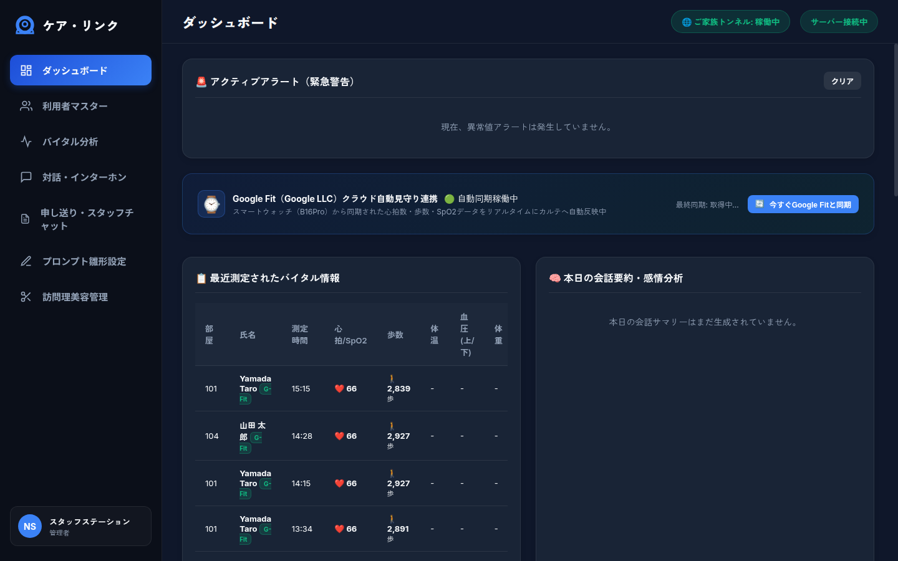

#### 主な機能・UI仕様
- **🏢 居室見守りマトリクス**: 全居室の入居者氏名、在室/離床状態、最新バイタル、AI対話稼働状態をグリッド一覧表示。
- **🚨 全画面割込赤色アラート**: 転倒検知やSOS発報時、画面全体が赤色点滅し、大音量警告音（Web Audio API）を鳴動。ワンクリックで即座に現場居室とインターホン通話を開始。
- **💓 リアルタイムバイタル記録テーブル**: 心拍数・SpO2・体温の推移を秒単位で監視。閾値異常時は行ハイライト警告。
- **📝 AIケア記録・カルテ自動ドラフト生成**: 会話要約、バイタルイベント、SOS発報ログを統合し、厚生労働省様式に即した介護日報下書きを自動生成。
- **📢 構内一斉放送 / 個別居室割込放送**: マイク入力から全居室端末または指定居室へ音声をリアルタイム割込配信。

---

### 3.3 ③ ご家族見守りポータル（ご家族モード / `/family/`）
離れたご家族がスマートフォンやPCからいつでも入居者様の様子を確認・交流できるWebポータル（GitHub Pages常時公開）。

#### 💻 📱 実機画面キャプチャ

**【PC大画面表示（デジタル絵手紙・会話履歴・バイタル一元表示）】**
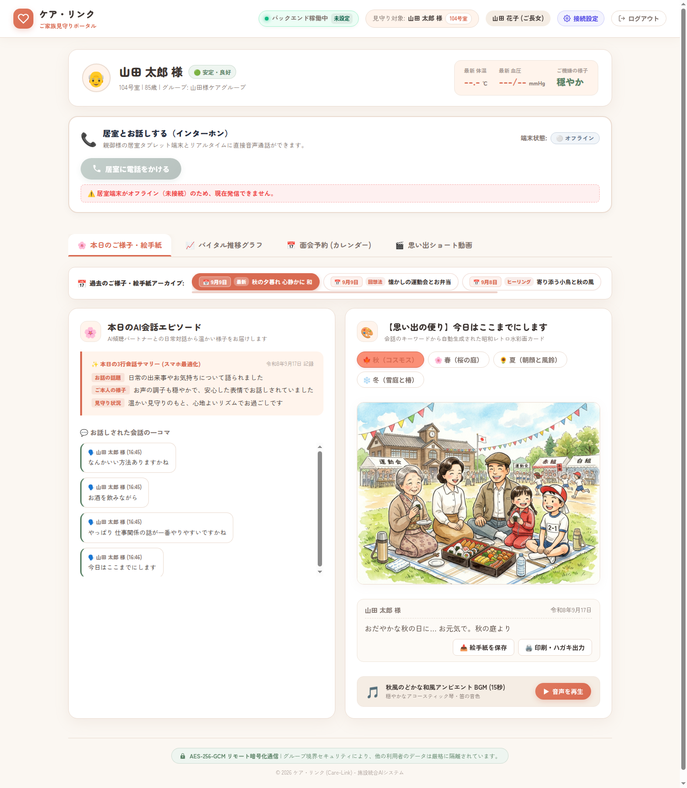

**【スマートフォン表示（見守りダイジェスト・タイムライン）】**
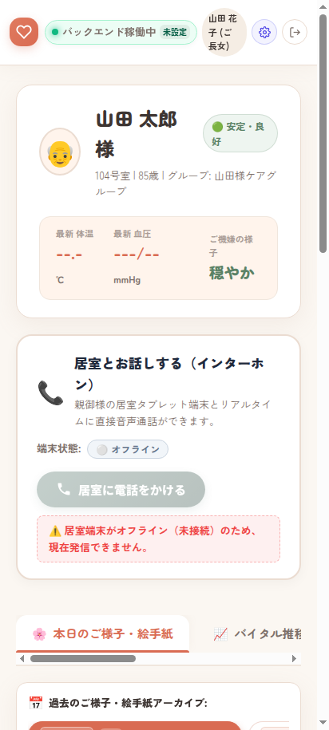

#### 主な機能・UI仕様
- **🎨 昭和レトロ水彩画風「デジタル絵手紙」カード**:
  - ジェミナイとの会話から自動抽出されたキーワードをもとに、心温まる水彩画イラストと絵手紙風の筆文字メッセージ（例: *「おだやかな秋の日に… お元気で。秋の庭より」*）を自動描画。
  - **四季・アーカイブ切替**: 🍁秋（コスモス）、🌸春（桜の庭）、🌻夏（朝顔と風鈴）、❄️冬（雪庭と椿）や過去日付の絵手紙をワンクリックで閲覧。
  - **保存 ＆ ハガキ印刷**: ワンクリックで高精細画像（JPG）をダウンロード、または官製ハガキサイズへの自動印刷に対応。
  - **和風アンビエントBGM**: 心落ち着く琴や篠笛の音色をワンタップで再生。
- **📖 「今日のご様子」AIレポート**: 会話トピックやバイタル推移をプライバシーに配慮して優しくまとめた家族向け日報。
- **💌 写真付きメッセージ送信**: スマートフォンから家族写真とお便りを送信（居室端末で自動ポップアップ＆音声読上）。
- **📅 オンライン面会予約**: 空き状況の確認と面会申請。

---

### 3.4 ④ 訪問理容・美容師ポータル（理容師モード / `barber`）
施設を定期訪問する理容師・美容師（外部専門職）専用の画面（アカウント: `barber01` / `barber123`）。
施術対象者の情報と、介護スタッフからの**「姿勢・認知症の注意点」**を一目で確認できます。

#### 💈 実機画面キャプチャ

**【PC・タブレット表示（横画面モード 1280x800）】**
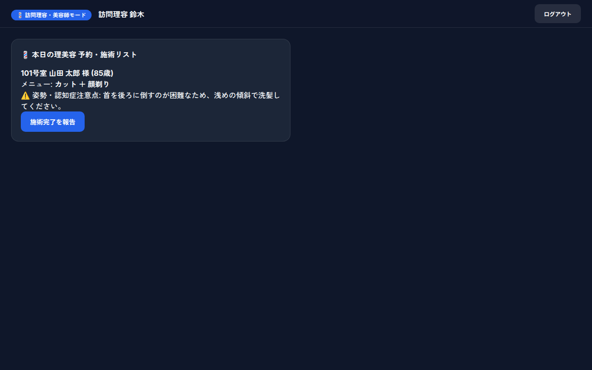

**【スマートフォン表示（縦画面モード 412x915）】**
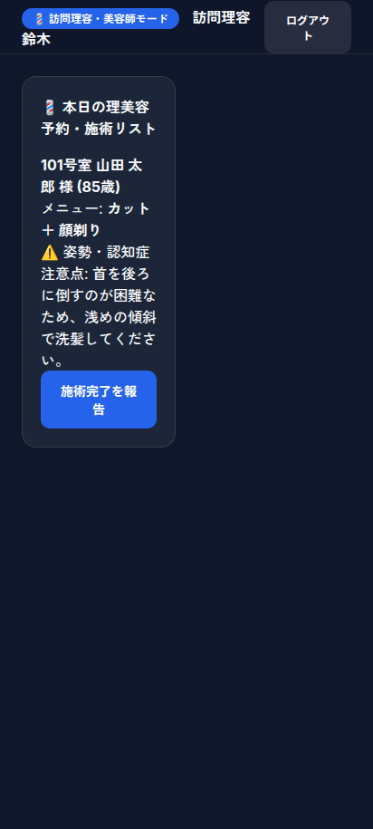

#### 主な機能・業務フロー
1. **本日の理美容 予約・施術リスト**:
   - 居室番号、氏名、年齢、メニュー（カット、顔剃り、パーマ等）を一覧表示。
2. **⚠️ 姿勢・認知症注意点の事前チェック（安全確保）**:
   - 介護スタッフがカルテに登録した重要な留意事項を黄色枠で警告表示。
   - 例: *「101号室 山田 太郎 様: 首を後ろに倒すのが困難なため、浅めの傾斜で洗髪してください。」*
   - 例: *「ハサミを近づけると警戒されるため、常に正面から優しくお声がけしてください。」*
3. **施術完了報告**:
   - 「施術完了を報告」ボタンを押下することで、施術後のご様子や頭皮・皮膚の状態がスタッフステーションのカルテ、およびご家族ポータルへ即座に共有されます。

---

## 💓 4. バイタル・生体センシング ＆ IoT連携仕様

### 4.1 デュアル経路バイタルデータパイプライン

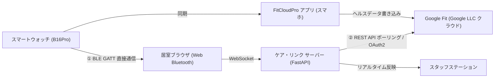

1. **経路 A（Web Bluetooth 直接通信）**:
   - 居室端末のブラウザからWeb Bluetooth APIを介して直接ペアリング。
   - **現場運用ノウハウ**: B16Proが未検出になった場合、**側面ボタン長押し ➔「再起動」** を実行することで即座にBLEアドバタイズが再開される仕様を特定・UIに案内反映済み。
2. **経路 B（Google Fit クラウド自動同期パイプライン）**:
   - `[B16Pro]` ➔ `[FitCloudPro]` ➔ `[Google Fit (Google LLC)]` ➔ `[ケア・リンク API (`/api/vitals/google-fit/sync`)]`
   - 実機心拍数（例: 69 bpm）および歩数（例: 15,412 歩）の生データ自動取得を実証済み。Google Fit アプリを常時開く必要なく、バックグラウンドで完全自動同期。

### 4.2 リアルタイム閾値監視エンジン
| バイタル項目 | 正常範囲 | 警告閾値 (Warning) | 重篤アラート (Emergency) | アクション |
| :--- | :--- | :--- | :--- | :--- |
| **心拍数 (HR)** | 60 〜 90 bpm | 50〜59 bpm (徐脈) / 91〜110 bpm (頻脈) | < 50 bpm (高度徐脈) / > 110 bpm (高度頻脈) | スタッフ画面赤色点滅 & 自動通報 |
| **血中酸素 (SpO2)** | 96 〜 100 % | 91 〜 95 % (軽度低酸素) | **≦ 90 % (呼吸不全アラート)** | 即時インターホン自動呼出 |
| **体温 (Temp)** | 36.0 〜 37.0 ℃ | 37.1 〜 37.5 ℃ (微熱) | **> 37.5 ℃ (発熱アラート)** | 看護スタッフ巡回タスク発行 |

---

## 🔒 5. ネットワーク・セキュリティ・堅牢性仕様

### 5.1 Cloudflare Zero-Trust 暗号化トンネル
- **ポート開放ゼロ**: 施設ルーターのグローバルポート開放は一切不要。`cloudflared` が外向き暗号化トンネルを確立。
- **GitHub Pages 自動同期**: トンネル起動時、`start_tunnel.sh` により発行された最新トンネルURLが `docs/tunnel_endpoint.json` を経由してGitHub Pagesへ自動プッシュされ、外部端末からの常時接続を保証。

### 5.2 プライバシー保護・PII対策
- **オンプレミス暗号化DB**: 個人情報、既往歴、介護日報は施設内PCの `nursing_facility.db`（AES/SQLCipher）に格納。
- **クラウドへの個人情報非送信**: Gemini Live への送信プロンプトからは本名・要介護度等の機微情報をマスクし、ニックネームと対話設定のみを連携。

---

## 📋 6. 今後の開発・拡張ロードマップ

1. **居室カメラ・姿勢推定による非接触転倒検知**:
   - 居室Webカメラ映像をローカル（RTX 2060S）のYOLO/MediaPipeで解析し、ベッドからの転落・床への倒れ込みを0.3秒で自動検知。
2. **訪問理美容 (`/barber/`) の独立SPA化**:
   - 居室・スタッフ・家族と同様に、スタイリッシュな専用モバイルUIとして独立画面を拡張。
3. **介護保険請求ソフト（ファーストケア等）とのCSV/API連携**:
   - AIが自動生成した介護日報ドラフトを施設既存の請求管理システムへワンクリックエクスポート。

---
*本書は Obsidian 形式（Markdown / Mermaid / Callouts 対応）にて出力されており、Obsidian Vault 内にそのまま配置して双方向リンク・グラフビューで閲覧いただけます。*
