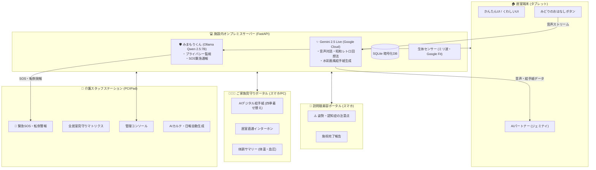

# 🏥 介護施設向け統合AI見守りプラットフォーム「ケア・リンク (CareLink)」
### 〜 Gemini Live × みまもりくん(Qwen 2.5) ハイブリッドAI・認知症アクティブケア・施設IoT統合プラットフォーム 〜

「**ケア・リンク (CareLink)**」は、介護施設における入居高齢者様の孤独解消・尊厳保持（QOL向上）と、介護スタッフの記録・見守り負担軽減を同時に達成するために設計された**次世代施設統合AIプラットフォーム**です。

---

## 📐 システム全体仕様書（Obsidianナレッジベース対応）

システムの詳細なアーキテクチャ、通信プロトコル、ハードウェア連携、およびデータフローについては、以下の仕様書をご参照ください。

👉 **[CareLink システム全体仕様書 (Obsidian対応)](CareLink_System_Specification_Obsidian.md)**  
*(※ [manuals/CareLink_System_Specification_Obsidian.md](manuals/CareLink_System_Specification_Obsidian.md) にも同仕様書を格納しています)*

### 仕様書に含まれる主な内容：
- **協調型ダブルAIアーキテクチャ**:
  - 超低遅延クラウドAI（**ジェミナイ / Gemini 2.5 Live**）による自然な会話・昭和レトロ回想法
  - オンプレミス常時監視エッジAI（**みまもりくん / Ollama Qwen 2.5:7B**）による生命安全・プライバシー保護
- **施設IoT・生体センシング連携**:
  - ミリ波レーダー（60GHz）による非接触転倒・離床検知
  - スマートウォッチ（Google Fit / Web Bluetooth）による心拍・歩数・SpO2監視
- **4大ポータル統合データフロー**:
  - WebSocket双方向通信 ＆ Cloudflare Tunnel外部セキュア公開仕様

---

## 📚 各種操作マニュアル・検証手順書一覧

各ポータルサイトの操作方法や第三者検証テスト手順書は、`manuals/` フォルダに目的別に整理されています。

👉 **[CareLink マニュアル・総合インデックスはこちら (manuals/README.md)](manuals/README.md)**  
👉 **[Webブラウザ版マニュアルインデックス (GitHub Pages)](https://k3and4ai-sudo.github.io/Nursing_facility/manuals/)**

| 対象読者 | マニュアル名 | 概要 | 形式 |
| :--- | :--- | :--- | :---: |
| 🏠 **入居高齢者様** | **[01. 居室端末 かんたん使い方ガイド](manuals/01_居室端末_かんたん使い方ガイド.md)** | 緑のボタンを1回押すだけでおしゃべり開始。想い出の絵や動画、SOSボタン。 | Markdown |
| 🏥 **介護スタッフ** | **[02. 介護スタッフステーション 業務操作マニュアル](manuals/02_介護スタッフステーション_業務操作マニュアル.md)** | 全居室見守りマトリクス、緊急SOS対応、Google Fit同期、AI日報自動生成。 | Markdown |
| 👨‍👩‍👧 **ご家族様** | **[03. ご家族見守りポータル 利用ガイド](manuals/03_ご家族見守りポータル_利用ガイド.md)** | 体調サマリー、昭和レトロ「デジタル絵手紙」、四季着せ替え、居室直通通話。 | Markdown |
| 💈 **訪問理美容師** | **[04. 訪問理容・美容師ポータル 利用手引き](manuals/04_訪問理容・美容師ポータル_利用手引き.md)** | 予約一覧確認、⚠️姿勢・認知症の注意点チェック、施術完了報告送信。 | Markdown |
| 🌐 **管理者・全関係者** | **[05. 各ポータルサイト接続URLガイド](manuals/05_各ポータルサイト接続URLガイド.md)** | 施設内LAN ＆ 外部トンネルの全接続URL一覧、初期ID/PASS、PWA設定。 | Markdown |
| 🧪 **外部テスター** | **[06. 第三者検証マニュアル 外部接続・操作テスト手順書](manuals/06_第三者検証マニュアル_外部接続・操作テスト手順書.md)** | ケアリンク4大特徴、QRコード一覧、第三者評価チェックシート完備。 | Markdown<br>＋<br>**[📄 PDF版](manuals/CareLink_第三者検証マニュアル.pdf)** |

> 📄 **印刷・配布用PDF**: [CareLink_第三者検証マニュアル.pdf を直接ダウンロード](https://github.com/k3and4ai-sudo/Nursing_facility/raw/main/manuals/CareLink_%E7%AC%AC%E4%B8%89%E8%80%85%E6%A4%9C%E8%A8%BC%E3%83%9E%E3%83%8B%E3%83%A5%E3%82%A2%E3%83%AB.pdf)

---

## 🌐 稼働中ポータルへの接続（Web実機）

外部インターネット（GitHub Pages Gateway）から、各ポータルの実機画面をお試しいただけます。

- **🏥 介護スタッフステーション**: [https://k3and4ai-sudo.github.io/Nursing_facility/staff/](https://k3and4ai-sudo.github.io/Nursing_facility/staff/)  
  *(ID: `staff01` / PASS: `staff123`)*
- **💈 訪問理容・美容師ポータル**: [https://k3and4ai-sudo.github.io/Nursing_facility/barber/](https://k3and4ai-sudo.github.io/Nursing_facility/barber/)  
  *(ワンタップ自動ログイン対応)*
- **👨‍👩‍👧 ご家族見守りポータル**: [https://k3and4ai-sudo.github.io/Nursing_facility/](https://k3and4ai-sudo.github.io/Nursing_facility/)  
  *(ID: `family01` / PASS: `family123`)*
- **🏠 居室端末（かんたん対話）**: [https://k3and4ai-sudo.github.io/Nursing_facility/user/](https://k3and4ai-sudo.github.io/Nursing_facility/user/)  
  *(自動接続: 101号室 山田様)*

---

## 🏗️ システム全体アーキテクチャ概要



---

## 🚀 ローカル開発環境セットアップ

### 1. 前提条件
- Python 3.12 以上
- [Ollama](https://ollama.com) がローカルで起動済み (`ollama pull qwen2.5:7b`)
- Google Gemini API Key

### 2. インストール
```bash
# リポジトリのクローン
git clone https://github.com/k3and4ai-sudo/Nursing_facility.git
cd Nursing_facility

# 仮想環境の作成とパッケージインストール
python3 -m venv .venv
source .venv/bin/activate
pip install -r backend/requirements.txt
```

### 3. 環境変数の設定
```bash
cp .env.example .env
# .env を編集して GEMINI_API_KEY などを設定
```

### 4. サーバーの起動
```bash
source .venv/bin/activate
uvicorn backend.main:app --host 0.0.0.0 --port 8000 --reload
```

---

## 📄 ライセンス
本プロジェクトは MIT License のもとで公開されています。
