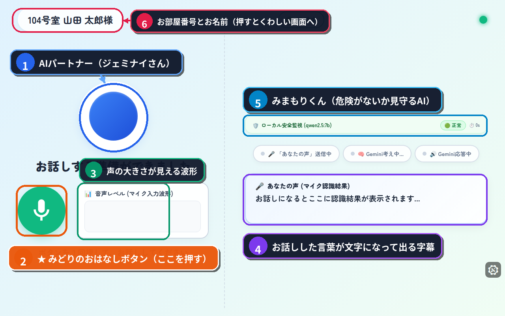
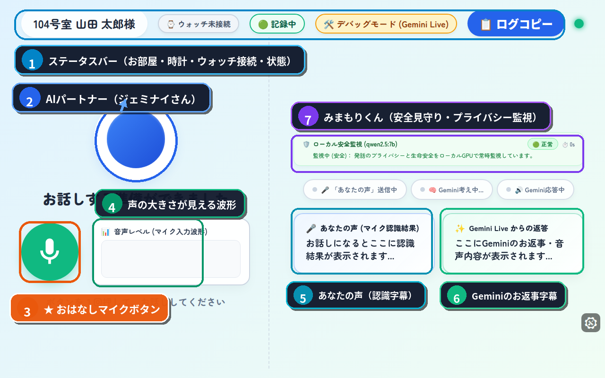

# 🌸 CareLink（ケアリンク）居室端末（きょしつたんまつ）
## 🍀 かんたん 使い方（つかいかた）ガイド
### 〜 お部屋（へや）のタブレットとおはなししてみよう 〜

こんにちは！
お部屋（へや）の机（つくえ）やベッドのそばにある **「タブレットがめん」** の使い方（つかいかた）をご案内（あんない）します。

むずかしい操作（そうさ）は ひとつもありません。
**みどり色のボタンを １回（かい）指（ゆび）でおすだけ** で、いつでもおしゃべりができますよ。

---

## 📺 １. がめんの見方（みかた）

がめんには **「かんたん画面（シンプル）」** と **「くわしい画面（詳細）」** の２しゅるいがあります。
ふだんは、字（じ）が大きくて見やすい **「かんたん画面」** になっています。

### 🌼 ① かんたん画面（ふだんの画面）



| 番号 | なまえ | どんなもの？（つかいかた） |
| :---: | :--- | :--- |
| <span style="background-color:#2563eb;color:#fff;padding:2px 8px;border-radius:12px;font-weight:bold;">①</span> | **AIパートナー（ジェミナイさん） 🔵** | まんまるい青い光のお友だちです。あなたがお話しすると、やさしくうなずくようにピカピカ光って、やさしい声でお返事（へんじ）してくれます。 |
| <span style="background-color:#ea580c;color:#fff;padding:2px 8px;border-radius:12px;font-weight:bold;">②</span> | **みどりのおはなしボタン 🎤** | **ここを１回（かい）ポンとおしてください！** 「ピピッ」と鳴（な）ったら、マイクにむかって自由（じゆう）にお話ししてください。もう１回おすとお話しがおわります。 |
| <span style="background-color:#059669;color:#fff;padding:2px 8px;border-radius:12px;font-weight:bold;">③</span> | **声の大きさが見える波形 📊** | あなたの声がちゃんと届（とど）いているか、ピコピコ動く波（なみ）でひと目でわかります。 |
| <span style="background-color:#7c3aed;color:#fff;padding:2px 8px;border-radius:12px;font-weight:bold;">④</span> | **お話しした言葉の文字（字幕） 💬** | あなたがお話しした言葉や、ジェミナイさんのお返事が、大きな文字になってここに出ます。耳が遠いときでも読んで安心です。 |
| <span style="background-color:#0284c7;color:#fff;padding:2px 8px;border-radius:12px;font-weight:bold;">⑤</span> | **みまもりくん（安全見守りAI） 🛡️** | あなたの安全をいつも見守ってくれる安心のAIです。困（こま）ったことや危険（きけん）がないか優しく見守っています。 |
| <span style="background-color:#e11d48;color:#fff;padding:2px 8px;border-radius:12px;font-weight:bold;">⑥</span> | **お部屋番号とお名前（切替ボタン） 🏷️** | あなたのお名前とお部屋番号です。ここを指でポンとおすと「くわしい画面」に切り替わります。 |

---

### 🌸 ② くわしい画面（よりくわしく見たいとき）

画面の上の「お部屋番号」をタッチするか、声で「画面をくわしくして」と言うと、時計や通信のようすが見える「くわしい画面」になります。



| 番号 | なまえ | どんなもの？（つかいかた） |
| :---: | :--- | :--- |
| <span style="background-color:#0284c7;color:#fff;padding:2px 8px;border-radius:12px;font-weight:bold;">①</span> | **ステータスバー ⌚** | あなたのお部屋番号、時計、スマートウォッチのつながり具合、お話の記録状態（緑のランプ）が並んでいます。 |
| <span style="background-color:#2563eb;color:#fff;padding:2px 8px;border-radius:12px;font-weight:bold;">②</span> | **AIパートナー（ジェミナイさん） 🔵** | かんたん画面とおなじ、青いまんまるい光のジェミナイさんです。お話しするとピカピカ光ってお返事してくれます。 |
| <span style="background-color:#ea580c;color:#fff;padding:2px 8px;border-radius:12px;font-weight:bold;">③</span> | **おはなしマイクボタン 🎤** | かんたん画面とおなじように、ここを１回ポンとおせば、いつでも楽しくおしゃべりができます。 |
| <span style="background-color:#059669;color:#fff;padding:2px 8px;border-radius:12px;font-weight:bold;">④</span> | **声の大きさが見える波形 📊** | あなたの声の大きさに合わせて、緑の枠の中で波がピコピコ動きます。 |
| <span style="background-color:#0891b2;color:#fff;padding:2px 8px;border-radius:12px;font-weight:bold;">⑤</span> | **あなたの声（マイク認識字幕） 🗣️** | あなたがお話しした言葉が、そのまま文字になってリアルタイムに表示されます。 |
| <span style="background-color:#10b981;color:#fff;padding:2px 8px;border-radius:12px;font-weight:bold;">⑥</span> | **Geminiのお返事テキスト字幕 ✨** | ジェミナイさんがお話ししてくれたお返事の言葉が、文字になってここに表示されます。 |
| <span style="background-color:#7c3aed;color:#fff;padding:2px 8px;border-radius:12px;font-weight:bold;">⑦</span> | **みまもりくん（安全見守りAI） 🛡️** | あなたの発話のプライバシーと安全をローカルAIが常時見守っています。 |

---

## 🗣️ ２. おはなしの はじめかた（３つのステップ）

おしゃべりするのは、とってもかんたんです！

```text
【ステップ１】 
 👉 まんまるい「みどりのマイクボタン」を指で１回ポンとおす。
       ↓
【ステップ２】 
 🗣️ タブレットにむかって、普通（ふつう）の声で「おはよう！」とお話しする。
       ↓
【ステップ３】 
 👂 ジェミナイさんが「おはようございます！ 今日もいいお天気ですね」とお返事してくれます。
```

> 💡 **おはなしのコツ**
> - 早口（はやくち）で言わなくても大丈夫（だいじょうぶ）です。ゆっくり、いつもの声でお話ししてください。
> - 同じことを何回お話ししても、ジェミナイさんは怒（おこ）ったり笑ったりしません。いつでも笑顔で聞いてくれますよ。

---

## 🎨 ３. むかしの思い出をお話ししてみよう

ジェミナイさんは、あなたの **「むかしの懐（なつ）かしいお話」** を聞くのが大すきです。

たとえば、こんなお話をしてみてください：
- 「若いころ、富士山（ふじさん）に登（のぼ）ったことがあるよ」
- 「子どものころ、お母さんが作ってくれた卵焼きがおいしかったなぁ」
- 「昔、飼（か）っていたシロという白い犬が可愛（かわい）かったよ」

お話しすると、AIがあなたの頭の中にある想い出を想像して、**世界にひとつだけの美しい絵や動画** を画面にパッと描（えが）き出してくれます！

---

## 🆘 ４. 困（こま）ったとき・痛（いた）いときは？

「足が痛くて動けない…」「お水がほしいな」「スタッフさんを呼びたいな」というときは、がまんしないでくださいね。

1. **声で「助けて！」「スタッフさん呼んで！」と言うだけ**
   - 声を出すと、画面いっぱいに大きな赤い「🚨 スタッフに連絡」ボタンがパッと出て、ナースステーションへすぐに連絡が届きます。
2. **手首のスマートウォッチが助けてくれます**
   - ベッドから転（ころ）んでしまったりしたときも、スマートウォッチが自動で気づいてスタッフさんに連絡してくれます。

これだけで、介護（かいご）スタッフステーションの大きなベルが鳴り、優しいスタッフさんがあなたのお部屋へすぐに駆けつけます。安心してくださいね。

---

## 🧙‍♂️ ５. 声でなんでも お願いできます

画面を指でさわるのが大変なときは、**声だけでお願い** できます！

- 「**画面をかんたんにして**」 ➔ すぐに大きなボタンのシンプル画面にもどります。
- 「**今日のニュースを教えて**」 ➔ 今日の明るいニュースを声で読んでくれます。
- 「**音楽をかけて**」 ➔ 懐かしい歌や、心が落ち着くメロディを流してくれます。

---

### 💖 いつでも、あなたのおそばにいます
このタブレットは、あなたとご家族、そして優しいスタッフさんをつなぐ「魔法（まほう）の窓（まど）」です。
寂（さび）しいときや、だれかと話したいときは、いつでも **みどりのボタン** をおしてくださいね！
