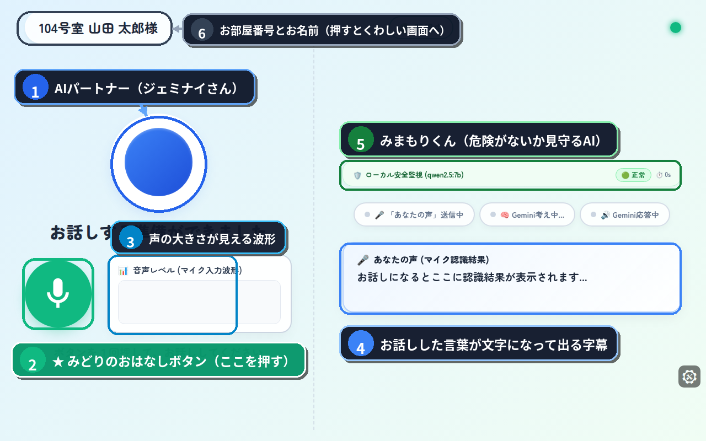
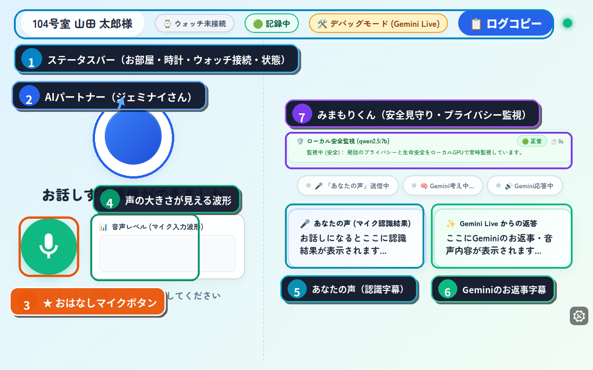

# 🌸 CareLink（ケアリンク）居室端末（きょしつたんまつ）
## 🍀 かんたん 使い方（つかいかた）ガイド
### 〜 お部屋（へや）のタブレットとおはなししてみよう 〜

こんにちは！  
お部屋（へや）の机（つくえ）やベッドのそばにある **「タブレットがめん」** の使い方（つかいかた）をご案内（あんない）します。

むずかしい操作（そうさ）は ひとつもありません。  
**みどり色のボタンを １回（かい）指（ゆび）でおすだけ** で、いつでもおしゃべりや予定の確認（かくにん）、たのしい絵手紙（えてがみ）づくりができますよ。

---

## 📺 １. がめんの見方（みかた）

がめんには **「かんたん画面（シンプル）」** と **「くわしい画面（詳細）」** の２しゅるいがあります。  
ふだんは、文字（もじ）が大きくて見やすい **「かんたん画面」** になっています。

### 🌼 ① かんたん画面（ふだんの画面）



| 番号 | なまえ | どんなもの？（つかいかた） |
| :---: | :--- | :--- |
| <span style="background-color:#2563eb;color:#fff;padding:2px 8px;border-radius:12px;font-weight:bold;">①</span> | **AIパートナー（ジェミナイさん） 🔵** | まんまるい青い光のお友だちです。あなたがお話しすると、やさしくうなずくようにピカピカ光って、やさしい声でお返事（へんじ）してくれます。 |
| <span style="background-color:#10b981;color:#fff;padding:2px 8px;border-radius:12px;font-weight:bold;">②</span> | **みどりのおはなしボタン 🎤** | **ここを１回（かい）ポンとおしてください！** 「ピピッ」と鳴（な）ったら、マイクにむかって自由（じゆう）にお話ししてください。もう１回おすとお話しがおわります。 |
| <span style="background-color:#0284c7;color:#fff;padding:2px 8px;border-radius:12px;font-weight:bold;">③</span> | **声の大きさが見える波形 📊** | あなたの声がちゃんと届（とど）いているか、ピコピコ動く波（なみ）でひと目でわかります。 |
| <span style="background-color:#3b82f6;color:#fff;padding:2px 8px;border-radius:12px;font-weight:bold;">④</span> | **お話しした言葉の文字（字幕） 💬** | あなたがお話しした言葉や、ジェミナイさんのお返事が、大きな文字になってここに出ます。耳が遠いときでも読んで安心です。 |
| <span style="background-color:#15803d;color:#fff;padding:2px 8px;border-radius:12px;font-weight:bold;">⑤</span> | **みまもりさん（安全見守りAI） 🛡️** | あなたの安全をいつも見守ってくれる安心のAIです。困（こま）ったことや危険（きけん）がないか優しく見守っています。 |
| <span style="background-color:#334155;color:#fff;padding:2px 8px;border-radius:12px;font-weight:bold;">⑥</span> | **お部屋番号とお名前（切替ボタン） 🏷️** | あなたのお名前とお部屋番号です。ここを指でポンとおすと「くわしい画面」に切り替わります。 |

---

### 🌸 ② くわしい画面（よりくわしく見たいとき）

画面の上の「お部屋番号とお名前」をタッチするか、声で「画面をくわしくして」と言うと、時計や通信のようすが見える「くわしい画面」になります。



| 番号 | なまえ | どんなもの？（つかいかた） |
| :---: | :--- | :--- |
| <span style="background-color:#334155;color:#fff;padding:2px 8px;border-radius:12px;font-weight:bold;">①</span> | **ステータスバー ⌚** | お部屋番号、スマートウォッチのつながり具合（タッチすると心拍数などが見られます）、お話の記録状態（緑のランプ）が並んでいます。 |
| <span style="background-color:#2563eb;color:#fff;padding:2px 8px;border-radius:12px;font-weight:bold;">②</span> | **AIパートナー（ジェミナイさん） 🔵** | かんたん画面とおなじ、青いまんまるい光のジェミナイさんです。お話しするとピカピカ光ってお返事してくれます。 |
| <span style="background-color:#10b981;color:#fff;padding:2px 8px;border-radius:12px;font-weight:bold;">③</span> | **おはなしマイクボタン 🎤** | かんたん画面とおなじように、ここを１回ポンとおせば、いつでも楽しくおしゃべりができます。 |
| <span style="background-color:#0284c7;color:#fff;padding:2px 8px;border-radius:12px;font-weight:bold;">④</span> | **声の大きさが見える波形 📊** | あなたの声の大きさに合わせて、枠の中で波がピコピコ動きます。 |
| <span style="background-color:#3b82f6;color:#fff;padding:2px 8px;border-radius:12px;font-weight:bold;">⑤</span> | **あなたの声（マイク認識字幕） 🗣️** | あなたがお話しした言葉が、そのまま文字になってリアルタイムに表示されます。 |
| <span style="background-color:#10b981;color:#fff;padding:2px 8px;border-radius:12px;font-weight:bold;">⑥</span> | **Geminiのお返事テキスト字幕 ✨** | ジェミナイさんがお話ししてくれたお返事の言葉が、文字になってここに表示されます。 |
| <span style="background-color:#15803d;color:#fff;padding:2px 8px;border-radius:12px;font-weight:bold;">⑦</span> | **状態ランプバー 💡** | 「🎤 送信中」「🧠 考え中」「🔊 応答中」「🎨 絵手紙更新中」と、今AIが何をしているかがランプで分かります。 |

---

## 🗣️ ２. おはなしの はじめかた（３つのステップ）

おしゃべりするのは、とってもかんたんです！

```text
【ステップ１】 
 👉 まんまるい「みどりのマイクボタン」を指で１回ポンとおす。
       ↓
【ステップ２】 
 🗣️ タブレットにむかって、普通（ふつう）の声で「おはよう！」とお話しする。
       ↓
【ステップ３】 
 👂 ジェミナイさんが「おはようございます！ 今日もいいお天気ですね」とお返事してくれます。
```

> 💡 **おはなしのコツ**
> - 早口（はやくち）で言わなくても大丈夫（だいじょうぶ）です。ゆっくり、いつもの声でお話ししてください。
> - 同じことを何回お話ししても、ジェミナイさんは怒（おこ）ったり困ったりしません。いつでも笑顔で聞いてくれますよ。
> - お話しを終わりにしたいときは、もう一度みどりのボタンを押すか、少し静かに待つとお返事が終わります。

---

## 📅 ３. 今日のご予定をたしかめる（予定カード）

「今日は何があるんだっけ？」「お風呂やリハビリは何時かな？」と思ったときは、画面の **「予定カード」** を見てみましょう！

```text
┌────────────────────────────────────────────────────────────┐
│ 📅 予定カード            2026年10月08日 (木)             [✕]│
│ 📅 日にち指定: [ 2026/10/08 📅 ]      [ 🔊 予定を聞く ]     │
├────────────────────────────────────────────────────────────┤
│  ・10:00 〜  リハビリテーション（機能訓練室）              │
│  ・14:00 〜  訪問理美容（ヘアカット・さっぱりしましょう）   │
│  ・15:00 〜  おやつ・季節のレクリエーション                │
│                                                            │
│ 🤖 みまもりさんの予定報告                                   │
│  「今日は午後2時から楽しみにされていた散髪（理容）ですね！」│
└────────────────────────────────────────────────────────────┘
```

### 🌟 予定カードのつかいかた
1. **画面でよむ**:  
   今日の予定が一覧になって分かりやすく並んでいます。
2. **🔊「予定を聞く」ボタンをおす**:  
   ボタンを指でポンとおすと、ジェミナイさんが優しい声で「今日の予定をお知らせしますね…」とすべて読み上げてくれます。
3. **📅 別の日付をみる**:  
   カレンダーの日付をタッチすると、明日や来週の予定もすぐに確認できます。
4. **カードをとじる・また出す**:  
   右上の「✕」を押すと画面がすっきりします。また見たいときは、画面中央の **「📅 予定」** ボタンを押せばいつでも開きます。

---

## 🎨 ４. 世界にひとつだけの「デジタル絵手紙」をつくろう

ジェミナイさんと昔の想い出をお話ししながら、色紙（しきし）に描いたような **手作りの水彩画絵手紙** を作ることができます！

画面中央の **「🎨 デジタル絵手紙」** ボタンを押すか、声で「絵手紙を描きたいな」とお話しすると始まります。

### 🌈 わかりやすい４つのステップ（シーケンシャル進行）

```text
 1. 聞き取り中 ➔ 2. 内容確認中 ➔ 3. 描画中 ➔ 4. 完成確認中 ➔ 💮 保存してご家族へお届け
```

#### ①【ステップ１】聞き取り中 👂
- ジェミナイさんが「どんな絵を描きましょうか？」と優しくたずねます。
- 「昔飼っていた白いマルチーズのシロ」「秋の紅葉と富士山」「故郷の夕焼け」など、自由に思い出をお話ししてください。
- あなたがお話しした言葉が、画面の **「聞き取った内容」** の枠にどんどん文字になって溜まります。
- お話しがまとまったら、**「この内容で次に進む ➔」** ボタンを指で押します。
  *(※お話をやり直したいときは「🗑️ 内容クリア」で消せます)*

#### ②【ステップ２】内容確認中 📝
- 「この内容で絵を描きますか？」という確認画面がパッと出ます。
  - **🖌️ 描く題材**: （例：座敷を走る白いマルチーズ）
  - **👂 要望詳細**: （例：元気いっぱいに尻尾を振っている様子）
  - **✍️ 添える筆文字**: （例：元気に 駆け回る姿に… 笑顔咲く）
- 「📝 プロンプト確認」ボタンを押すと、AIへの詳しい指示も確認できます。
- よろしければ、**「🎨 これで描く (はい)」** ボタンをポンと押してください。  
  *(直したいときは「✏️ 直す (いいえ)」を押すと聞き取りに戻ります)*

#### ③【ステップ３】AIが心をこめて描画中 🔄
- 色紙の真ん中で「AIが新しい絵手紙を描いています…」の輪っかがくるくる回ります。
- およそ **10秒〜15秒** ほどで、筆文字と落款印（🌸の赤いハンコ）が入った水彩画が自動的に仕上がります！

#### ④【ステップ４】完成確認中 ✨
- 描き上がった絵が画面いっぱいに表示されます。
- 「この絵で完成にしてよろしいですか？」と聞かれます。
  - **💮 これで完成にする (はい)** ➔ 次の保存へ進みます。
  - **✏️ 描き直す (いいえ)** ➔ 題材や色をもう一度手直しできます。

#### 💾 【安心の保存確認】画面タッチでお答えください 💮
- ジェミナイさんが声で  
  **「この絵手紙を完成として保存しますか？ よろしければ画面のボタンをタッチしてくださいね」**  
  と優しく案内します。
- 音声の誤判定を防ぐため、**回答は声ではなく【画面タッチのみ】** で安全に行われます。
- 画面の **「💮 完成・保存する (はい)」** ボタンをタッチすると保存が完了します！
- 保存された絵手紙は、**離れて暮らすご家族の見守りスマートフォンや、施設のスタッフステーションへすぐに届けられます。**

> 🔍 **「大きく見る」で大画面鑑賞**  
> 絵手紙の右上にある **「🔍 大きく見る」** を押すと、タブレット全体が大きな色紙額縁（がくぶち）になります。  
> 開いたままでもマイクでお話しできるので、「もうちょっと夕焼けを濃くして」など声で手直しも楽しめます。

---

## 🔒 ５. 内緒（ないしょ）のお話・プライバシーの安心保護

「誰にも聞かれたくない家族の相談がある」「ここだけの秘密にしてほしい」というときも安心です。

1. **声で「これ内緒にしてね」「ここだけの話にして」と言うだけ**
2. 画面にむらさき色の **「🔒 会話記録を停止しました」** というカードが出ます。
3. この間のおしゃべりは、日誌や記録には一切残りません。ジェミナイさんとあなただけの秘密のお部屋になります。
4. いつもの見守りに戻したいときは、**「▶️ 記録を再開する」** ボタンをタッチしてください。

> 🛡️ **個人情報もしっかり守ります**  
> 万が一、銀行の暗証番号や個人情報をお話ししてしまった場合も、安心AI「みまもりさん」が自動で気づき、安全のために会話を一時停止してくれます。

---

## 🆘 ６. 困（こま）ったとき・痛（いた）いときは？

「足が痛くて動けない…」「お水がほしいな」「スタッフさんを呼びたいな」というときは、がまんしないでくださいね。

### ① 声を出すだけで呼べます 🗣️
- **「助けて！」「痛い！」「スタッフさん呼んで！」** とタブレットにむかって声を出してください。
- 画面いっぱいに大きな赤い **「🚨 スタッフに連絡」** ボタンがパッと出ます。
- ボタンを押すと、ナースステーションの大きなベルが鳴り、スタッフさんがすぐに駆けつけます。
- （間違えて声が出たときは「💬 会話をつづける」を押せば元に戻ります）

### ② 手首のスマートウォッチが助けてくれます ⌚
- ベッドから転（ころ）んでしまったりしたときも、スマートウォッチが自動で気づいてスタッフさんに緊急連絡してくれます。
- 画面の上の「⌚ ウォッチ」バッジを押すと、いまの元気な心拍数を見ることもできます。

### ③ スタッフさんからのお電話（インターホン） 📞
- スタッフさんからタブレットにお電話がかかってくると、「プルルル…」と呼び出し音が鳴ります。
- 画面の **「受話器（出る）」** ボタンを押すとお部屋にいながらお話しできます。
- 緊急のときは、ボタンを押さなくても自動的にお部屋の声が通じる「緊急ハンズフリー」機能もついています。

---

## 🧙‍♂️ ７. 声でなんでも お願いできます（便利な声の魔法）

画面を指でさわるのが大変なときは、**声だけでお願い** できます！

- 「**画面をかんたんにして**」 / 「**画面をくわしくして**」  
  ➔ 画面の文字の大きさを声で切り替えられます。
- 「**今日の予定を教えて**」  
  ➔ 今日のスケジュールを声で読み上げてくれます。
- 「**絵手紙を描きたい**」  
  ➔ デジタル絵手紙の聞き取りがすぐに始まります。
- 「**今日のニュースを教えて**」  
  ➔ 今日の明るいニュースを声で読んでくれます。
- 「**懐かしい音楽をかけて**」  
  ➔ 心が落ち着く昭和のメロディを流してくれます。

---

## 👨‍👩‍👧 ご家族様・介護スタッフ様へ（サポートの手引き）

入居者様が快適にお使いいただけるよう、以下のポイントをご確認ください。

### 1. 起動時の自然な挨拶
端末を起動または再読み込みした際、前回の会話や絵手紙画面はいったんすべてクリアされ、「〇〇さん、こんにちは！」の明るい挨拶から穏やかに始まります。

### 2. 絵手紙作成の介助
入居者様がお話しされた内容は、ステップ1で画面上に文字として連続蓄積されます。耳が遠い方や話すのが疲れた方には、ご家族やスタッフ様が画面の「この内容で次に進む」や「これで描く」ボタンを代わりにタッチしてサポートしてあげてください。

### 3. 保存の安心仕様
描画後の仕上がり確認・保存確認は、誤認識による自動保存を防ぐため「画面タッチ」が必須となっております。画面を見て「この絵でいいね！」と納得された上で「💮 完成・保存する」をタッチしていただくようお声がけください。

### 4. 画面上部のステータスランプ確認
- **お部屋番号とお名前バッジ**: タッチでシンプル画面／詳細画面をいつでも切り替えられます。
- **⌚ ウォッチバッジ**: スマートウォッチのBluetooth接続状態を表示。タップすると心拍・SpO2モニタが開きます。
- **🟢 記録中バッジ**: 通常時は緑色。「内緒話モード」時は紫色に変わり、記録が停止していることが一目で分かります。
- **通信ランプ（右端）**: 🟢（正常通信） / 🔴（通信切断・再接続中）。

---

### 💖 いつでも、あなたのおそばにいます
このタブレットは、あなたとご家族、そして優しいスタッフさんをつなぐ「魔法（まほう）の窓（まど）」です。  
寂（さび）しいときや、だれかと話したいときは、いつでも **みどりのボタン** をおしてくださいね！
