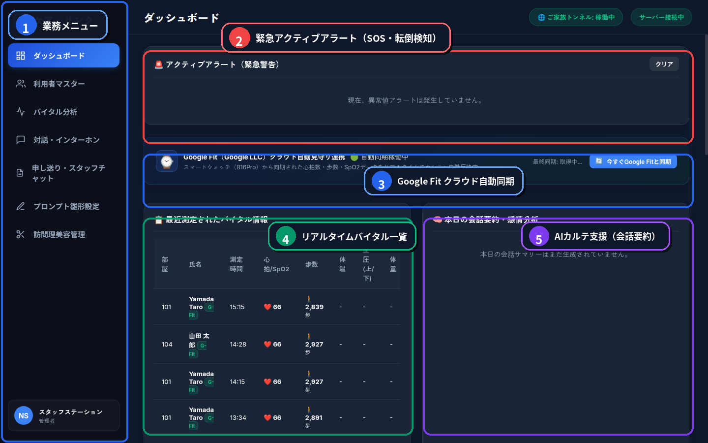

# 🏥 CareLink（ケアリンク）介護スタッフステーション
## 📋 業務操作マニュアル
### 〜 入居者様の安心を見守り、介護記録の手間をゼロにする現場ガイド 〜

本マニュアルは、施設内のナースステーションおよび介護スタッフ向けに、CareLink統合管理画面の操作手順を分かりやすく解説したものです。

専門的なパソコン用語は使わず、日々の見守り業務や緊急時の初動対応に直結する手順を高校1年生レベルの平易な表現でまとめています。

> 🌐 **アクセスURL**
> - **施設内PC / iPad**: `http://[サーバーIP]:8000/staff/` または `http://localhost:8000/staff/`
> - **外部インターネット (外出先・固定)**: `https://k3and4ai-sudo.github.io/Nursing_facility/staff/`
> - **初期アカウント**: ID: `staff01` / PASS: `staff123`

---

## 🖥️ １. 画面全体のレイアウトと基本機能

スタッフステーションのパソコンを開くと、施設全体の状況が一目でわかる **「ダッシュボード画面」** が表示されます。



| 番号 | 機能名 | 現場での役割と概要 |
| :---: | :--- | :--- |
| <span style="background-color:#2563eb;color:#fff;padding:2px 8px;border-radius:12px;font-weight:bold;">①</span> | **業務メニュー（サイドバー）** | ダッシュボード、利用者マスター、バイタル分析、対話・インターホン、申し送り・スタッフチャット、訪問理美容管理などの各業務画面をワンクリックで切り替えます。 |
| <span style="background-color:#ef4444;color:#fff;padding:2px 8px;border-radius:12px;font-weight:bold;">②</span> | **緊急アクティブアラート** | 入居者様のSOS呼び出し、ミリ波レーダーによる転倒検知、バイタル急変アラートが赤色で通知されます。「クリア」ボタンで確認・解除できます。 |
| <span style="background-color:#2563eb;color:#fff;padding:2px 8px;border-radius:12px;font-weight:bold;">③</span> | **Google Fit クラウド自動同期** | スマートウォッチ（B16Pro）から取得された心拍数・歩数・SpO2データをクラウド経由でリアルタイム反映中。「今すぐGoogle Fitと同期」で手動即時更新も可能です。 |
| <span style="background-color:#059669;color:#fff;padding:2px 8px;border-radius:12px;font-weight:bold;">④</span> | **最近測定されたバイタル一覧** | 各部屋の最新測定データ（部屋番号、氏名、測定時刻、心拍/SpO2、歩数、体温、血圧、体重）を一覧表示し、異常値の早期発見をサポートします。 |
| <span style="background-color:#7c3aed;color:#fff;padding:2px 8px;border-radius:12px;font-weight:bold;">⑤</span> | **本日の会話要約・AIカルテ支援** | 居室のAIパートナーと入居者様が交わした日常会話から、今日のご機嫌や関心事、ケアの注意点をAIが自動抽出し、介護日報の下書きを支援します。 |

---

## 🚨 ２. 緊急SOS・転倒アラート発生時の対応フロー

入居者様が「助けてボタン」を押した時や、ミリ波レーダーが転倒を検知した時は、**何よりも最優先** で以下の手順を行います。

```text
【ステップ１：警報の発生】
 画面全体が赤く点滅し、警告音（ピロピロピロ…）が鳴り響きます。
 画面中央に「⚠️ 101号室 佐藤様：転倒の疑い」と大きく表示されます。
       ↓
【ステップ２：警報停止ボタンを押す】
 アラート枠内の「警報停止」ボタンを1回クリックして、警告音を止めます。
       ↓
【ステップ３：相互インターホンで呼びかける】
 画面の「居室と通話する」ボタンを押し、マイクで呼びかけます。
 「佐藤さん、大丈夫ですか？ スタッフの山田です。今すぐお部屋に向かいます！」
 （※居室のタブレットからハンズフリーで入居者様の声が聞こえます）
       ↓
【ステップ４：現場へ急行し、対応完了を記録】
 お部屋へ急行して入居者様の安全を確保します。
 戻った後、アラート欄の「対応完了」ボタンを押して通常状態に戻します。
```

> ⚠️ **注意点**
> 誤報（寝返りで布団が落ちた等）であっても、必ずインターホンでお声をかけ、ご本人の無事を目視・口頭で確認してください。

---

## 💓 ３. リアルタイムバイタル（体調）の確認方法

見守りカードをクリックすると、その部屋の詳しい生体データ（バイタルサイン）を確認できます。

### 基準値の目安（正常な範囲）
- **心拍数（脈拍）**: 60 〜 90 bpm （100以上、または50以下で黄色注意）
- **血中酸素（SpO2）**: 95% 〜 99% （**92%以下** で赤色警告 ➔ 看護師へ即座に報告）
- **体温**: 36.0℃ 〜 37.2℃ （37.5℃以上で発熱注意）
- **睡眠深度**: 「覚醒」「浅い睡眠」「深い睡眠」が棒グラフで自動記録されます。

夜間巡回時、寝息を立てている入居者様を起こすことなく、モニター越しに呼吸と心拍の安定を確認できます。

---

## 📝 ４. AI自動日報（カルテ支援）の使い方

夕方の申し送り時や夜勤明けの記録業務は、AI（みまもりくん）が大部分を下書きしてくれます。

1. **ダッシュボードまたは「申し送り・スタッフチャット」タブを開く**
   - ダッシュボード右下の「本日の会話要約・感情分析」カード、または左側メニューの「申し送り・スタッフチャット」をクリックします。
2. **自動まとめを確認する**
   - AIが入居者様との会話から「今日のご機嫌」「食事の話題」「昔の思い出（回想法）」を抽出し、客観的な文章にまとめています。
   - 例：「本日14時頃、故郷のリンゴ農園の思い出を笑顔で回想。水分補給を促し自力摂取良好。夕方バイタル安定。」
3. **内容を確認・微修正して確定**
   - 必要に応じてスタッフ自身のメモを書き足し、「記録を保存」ボタンを押すだけで日報が完了します。
   - これにより、毎日の記録作成時間を大幅に短縮できます。

---

## 📢 ５. 構内一斉放送マイク・居室インターホンの使い方

施設全体へ一括でお知らせを届けたいときや、各居室と直接通話したいときに使います。

1. 左側メニューの **「対話・インターホン」** をクリックします。
2. **一斉放送の場合**：
   - 「構内一斉放送」ボタンを押し、パソコンのマイクに向かってお話しします。
   - 例：「皆様、こんにちは。15時になりましたので、1階デイルームにて体操レクリエーションを始めます。」
   - 全居室のタブレット端末から、クリアな音声でアナウンスが流れます。話し終わったら「放送終了」を押します。
3. **居室個別通話の場合**：
   - 呼び出したい部屋番号を選んで「通話開始」を押すと、居室端末とハンズフリーで直接お話しできます。

---

## ❓ よくある質問とトラブル解決

- **Q. 居室のカメラ映像が真っ暗で映らないのですが？**
  - **A.** CareLinkはプライバシー保護のため、普段はカメラ映像ではなく「ミリ波レーダーのシルエット（棒人間）」で状態を表示しています。緊急SOS発生時や通話時のみ、プライバシー保護を解除した映像確認が可能です。
- **Q. 入居者様が「画面を元に戻してほしい」と言っている**
  - **A.** スタッフ画面の居室カード内にある「UI切替」ボタンを押すか、入居者様に「画面をかんたんにして」とタブレットへ話しかけていただくようお伝えください。
