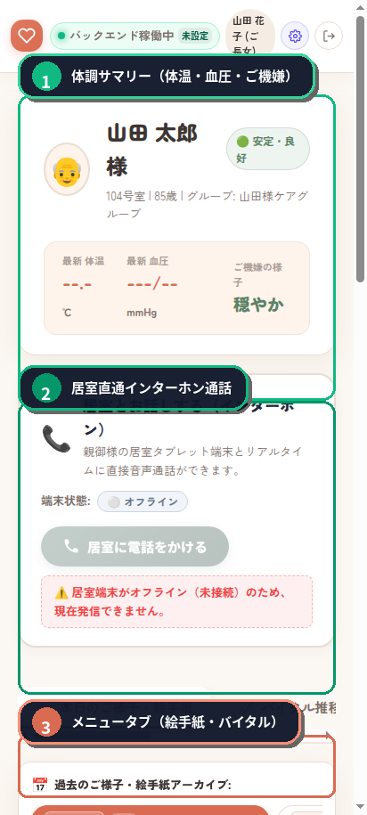
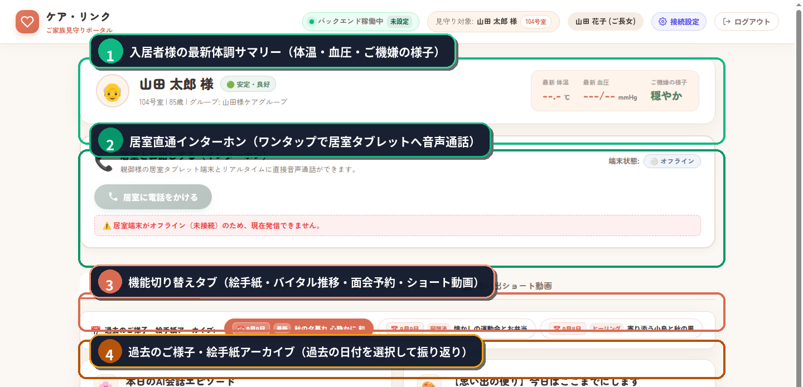
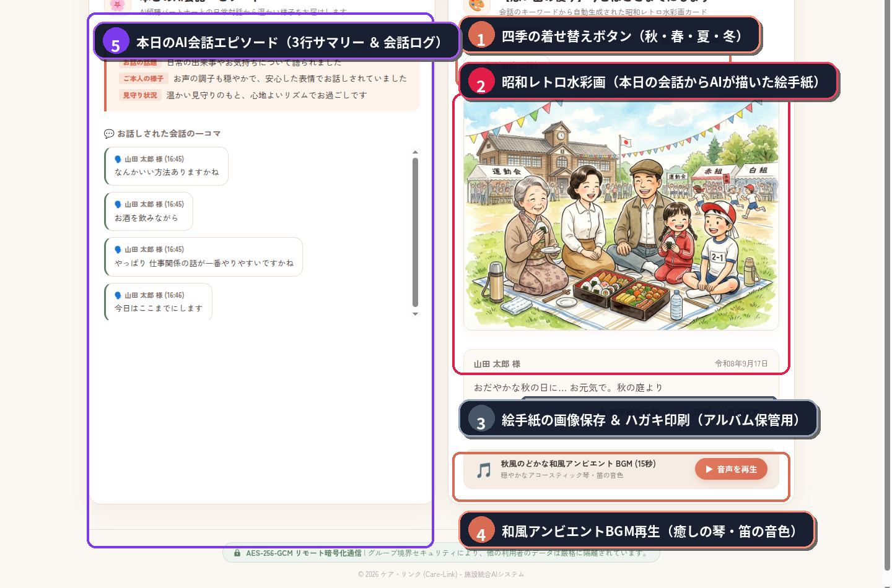

# 🏡 CareLink（ケアリンク）ご家族見守りポータル
## 📱 利用ガイド（スマートフォン・パソコン対応）
### 〜 離れていても、いつもそばに。日々の笑顔と想い出をお届けします 〜

CareLink「ご家族見守りポータル」をご利用いただき、誠にありがとうございます。

本ポータルは、施設で暮らすご家族（お父様・お母様など）の「今日のご様子」や「健康状態」を、スマートフォンやご自宅のパソコンからいつでも温かく見守ることができるWebサービスです。

高校1年生でも直感的に使いこなせるよう、分かりやすいイラストや画面キャプチャを交えて操作手順をご案内します。

> 🌐 **アクセスURL（スマートフォン・PC対応）**
> - **ご家族専用 固定URL**: `https://k3and4ai-sudo.github.io/Nursing_facility/`
> - **初期アカウント**: ID: `family01` / PASS: `family123`

---

## 📱 １. スマートフォンでの基本操作

普段のお出かけ先や通勤時間など、手軽に様子を確認したいときはスマートフォンをご利用ください。



| 番号 | 機能名 | つかいかた・特徴 |
| :---: | :--- | :--- |
| <span style="background-color:#10b981;color:#fff;padding:2px 8px;border-radius:12px;font-weight:bold;">①</span> | **体調サマリー（体温・血圧・ご機嫌） 💓** | 入居者様の最新の体温、血圧、ご機嫌の様子（「穏やか」など）、健康状態（「安定・良好」）がひと目で確認できます。 |
| <span style="background-color:#059669;color:#fff;padding:2px 8px;border-radius:12px;font-weight:bold;">②</span> | **居室直通インターホン通話 📞** | 「居室に電話をかける」ボタンをワンタップするだけで、入居者様のお部屋のタブレット端末と直接リアルタイムに音声通話ができます。 |
| <span style="background-color:#d96b52;color:#fff;padding:2px 8px;border-radius:12px;font-weight:bold;">③</span> | **メニュータブ（絵手紙・バイタル） 📑** | 「本日のご様子・絵手紙」「バイタル推移グラフ」「面会予約カレンダー」などの各機能へ素早く切り替えられます。 |

---

## 💻 ２. パソコン大画面での楽しみ方（上下2画面で全体を解説）

ご自宅のパソコンなどの大画面で開くと、まるで毎日の絵手紙が届いたかのような美しい「デジタル絵手紙」と、詳細な健康・会話履歴をお楽しみいただけます。画面全体が分かりやすいよう、**【上部画面】** と **【下部画面】** の2つに分けてご案内します。

### 🌤️ 【上部画面】基本情報・インターホン・各種メニュー

画面の上半分では、入居者様の健康サマリーの確認や、居室タブレットへの直通インターホン通話、過去の記録へのアクセスが行えます。



| 番号 | 機能名 | つかいかた・特徴 |
| :---: | :--- | :--- |
| <span style="background-color:#10b981;color:#fff;padding:2px 8px;border-radius:12px;font-weight:bold;">①</span> | **入居者様の最新体調サマリー 🩺** | お名前、最新体温、最新血圧、ご機嫌（穏やか・活気・休養中など）、健康判定（安定・良好）がカード形式で分かりやすく表示されます。 |
| <span style="background-color:#059669;color:#fff;padding:2px 8px;border-radius:12px;font-weight:bold;">②</span> | **居室直通インターホン（ワンタップ通話） 📞** | 「居室に電話をかける」ボタンを押すと、お部屋のタブレットが鳴り、直接ハンズフリーで声を聞きながらお話しできます。 |
| <span style="background-color:#d96b52;color:#fff;padding:2px 8px;border-radius:12px;font-weight:bold;">③</span> | **機能切り替えタブバー 📑** | 「本日のご様子・絵手紙」「バイタル推移グラフ」「面会予約（カレンダー）」「思い出ショート動画」をワンクリックで切り替えられます。 |
| <span style="background-color:#b45309;color:#fff;padding:2px 8px;border-radius:12px;font-weight:bold;">④</span> | **過去のご様子・絵手紙アーカイブ 📅** | カレンダーの日付ボタン（「9月9日 秋の夕暮れ」「9月8日 懐かしの運動会」など）を選ぶと、過去の絵手紙やお話をいつでも振り返ることができます。 |

---

### 🎨 【下部画面】デジタル絵手紙・AI会話エピソード・和風BGM

画面の下半分では、本日のAI会話から生まれた「昭和レトロ水彩画」や会話の詳しい様子を鑑賞し、ハガキ印刷やBGM再生が楽しめます。



| 番号 | 機能名 | つかいかた・特徴 |
| :---: | :--- | :--- |
| <span style="background-color:#d96b52;color:#fff;padding:2px 8px;border-radius:12px;font-weight:bold;">①</span> | **四季の着せ替えボタン（秋・春・夏・冬） 🍁** | 「秋（コスモス）」「春（桜の庭）」「夏（朝顔と風鈴）」「冬（雪庭と椿）」のボタンを押すと、絵手紙のフレームや雰囲気を季節に合わせて自由に着せ替えできます。 |
| <span style="background-color:#e11d48;color:#fff;padding:2px 8px;border-radius:12px;font-weight:bold;">②</span> | **昭和レトロ水彩画（本日の絵手紙） 🖼️** | AIが入居者様との楽しい昔話（運動会やお弁当の想い出など）から、温かいタッチの水彩画を自動生成してお届けします。 |
| <span style="background-color:#475569;color:#fff;padding:2px 8px;border-radius:12px;font-weight:bold;">③</span> | **絵手紙保存 ＆ ハガキ印刷 🖨️** | 「ハガキ出力」ボタンを押すと、年賀状・ポストカードサイズで家庭用プリンターから印刷できます。「絵手紙を保存」で画像データとしても保存可能です。 |
| <span style="background-color:#d96b52;color:#fff;padding:2px 8px;border-radius:12px;font-weight:bold;">④</span> | **和風アンビエントBGM再生 🎵** | 「音声を再生」を押すと、心が安らぐ心地よいお琴と笛の音色が流れ、絵手紙をより情緒豊かに鑑賞できます。 |
| <span style="background-color:#7c3aed;color:#fff;padding:2px 8px;border-radius:12px;font-weight:bold;">⑤</span> | **本日のAI会話エピソード 💬** | 左側のパネルに、「本日の3行会話サマリー（お話の話題・ご本人の様子・見守り状況）」と、入居者様が実際にお話しされた「会話の1コマ」が記録されます。 |

---

## 💌 ３. 写真やメッセージを送る手順（居室端末への自動読み上げ）

スマートフォンまたはパソコンから、入居者様へ簡単に「お便り」を届けることができます。

```text
【ステップ１】
 ポータル画面の「メッセージ入力欄」に言葉を入力します。
 （例：「お父さん、今日は暖かくていい天気だね。週末に会いに行くよ！」）
       ↓
【ステップ２】
 「写真を選ぶ」ボタンを押し、スマホやPCの中にあるお気に入りの写真（ひ孫さんの写真や旅行の写真など）を選択します。
       ↓
【ステップ３】
 「送信する」ボタンを押します。
       ↓
【お届け完了！】
 居室のタブレット画面にパッと写真とメッセージが表示され、
 AIパートナーが「〇〇さんから素敵なお写真とお手紙が届きましたよ！」と優しい声で読み上げてくれます。
```

---

## 🖨️ ４. デジタル絵手紙をポストカードに印刷する方法

パソコン画面右下の **「ハガキサイズで印刷」** ボタンを押すと、印刷プレビューが開きます。

1. プリンターに「ハガキ用紙」または「A4用紙」をセットします。
2. 画面の印刷ボタンを押します。
3. 四季の彩りと入居者様の想い出が描かれた、世界にひとつだけのオリジナル絵手紙が印刷されます。
4. ご家族のアルバムに挟んだり、冷蔵庫や机に飾って日々の記録としてお楽しみください。

---

## 🔒 プライバシーとセキュリティについて
- ご家族ポータルで閲覧できるデータは、すべて最高水準の暗号化（SSL/TLS暗号化）によって厳重に保護されています。
- 登録されたご家族以外に情報が公開されることは一切ありませんので、安心してご利用ください。
