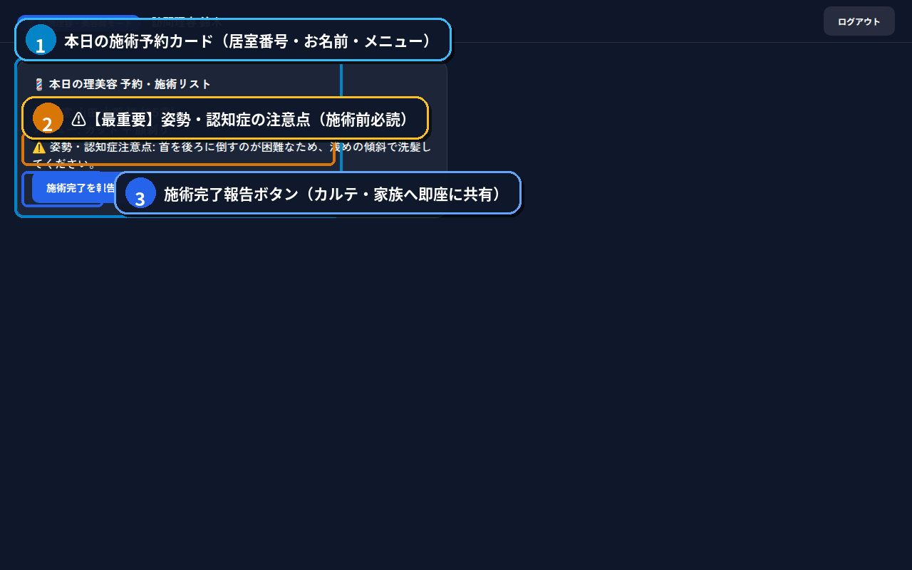

# ✂️ CareLink（ケアリンク）訪問理容・美容師ポータル
## 💈 利用手引き（タブレット・スマートフォン対応）
### 〜 入居者様の安全を守り、笑顔を引き出すスマート施術ガイド 〜

訪問理容師・美容師の皆様、いつも入居者様の身だしなみと笑顔を支えていただきありがとうございます。

本ポータルは、施設へ訪問された理容師・美容師様が、**「入居者様ごとの注意点（姿勢・認知症症状・拘縮など）」を事前に素早く確認し、施術完了報告をスムーズに施設スタッフへ引き継ぐ** ための専用画面です。

現場の慌ただしい時間でも迷わず使えるよう、高校1年生レベルの平易な言葉でまとめました。

> 🌐 **アクセスURL（スマホ・タブレット対応）**
> - **外部インターネット (固定・推奨)**: `https://k3and4ai-sudo.github.io/Nursing_facility/barber/`
> - **施設内Wi-Fi**: `http://[サーバーIP]:8000/?demo=barber`
> - **初期アカウント**: ID: `barber01` / PASS: `barber123` *(上記URLからワンクリックで自動ログイン)*

---

## 📱 １. 画面の見方と基本レイアウト

施術開始前に、お持ちのタブレットまたはスマートフォンで専用画面を開きます。



| 番号 | 機能名 | 現場での使い方とポイント |
| :---: | :--- | :--- |
| <span style="background-color:#0284c7;color:#fff;padding:2px 8px;border-radius:12px;font-weight:bold;">①</span> | **本日の予約一覧** | 今日担当する入居者様のお名前、お部屋番号（101号室など）、希望メニュー（カット・顔剃り・シャンプー等）が並んでいます。 |
| <span style="background-color:#d97706;color:#fff;padding:2px 8px;border-radius:12px;font-weight:bold;">②</span> | **⚠️【最重要】姿勢・認知症の注意点** | 施術時に特に配慮すべき注意事項が黄色・オレンジ色の注意枠で大きく表示されます。**ハサミやカミソリを当てる前に必ず確認してください。** |
| <span style="background-color:#2563eb;color:#fff;padding:2px 8px;border-radius:12px;font-weight:bold;">③</span> | **施術完了を報告ボタン 📝** | 画面内の青色ボタンです。カット終了後、ご本人のご機嫌や頭皮・皮膚の状態を一言選んで送信します。 |

---

## ⚠️ ２. 【最重要】施術前の「安全確認」チェック項目

高齢者施設での施術では、思わぬ体動や体勢の崩れによるケガを防ぐため、**施術前に必ず画面②（黄色・オレンジ枠）の注意点を確認** してください。

### よくある注意点と現場での対応例

1. **首の角度・洗髪時の注意（頸部後屈制限）**
   - 首を後ろへ強く倒すと、めまいや血圧低下、誤嚥（ごえん）のリスクがあります。
   - ➔ *シャンプー時は前かがみで行うか、無理のない自然な角度を保ってください。*
2. **急な体動・手の動き（認知症症状）**
   - 鏡の前のハサミに急に手を伸ばされたり、不意に立ち上がろうとされる場合があります。
   - ➔ *道具は入居者様の手が届かない位置に置き、常に「今から襟足を切りますね」と優しく声をかけながら施術してください。*
3. **皮膚の乾燥・デリケートな肌（顔剃り時の注意）**
   - お肌が薄く傷つきやすいため、シェービングフォームや保湿剤をしっかり塗布し、刃を優しくあててください。
4. **関節の硬さ（拘縮）**
   - 腕や肩が上がりにくい方には、無理にクロスを引っ張らず、楽な姿勢のままで着用させてください。

---

## 📝 ３. 施術完了報告の送り方（３ステップ）

カットやセットが終わったら、施設スタッフやご家族への引き継ぎ記録を送信します。紙に手書きする必要はありません。

```text
【ステップ１】
 該当する入居者様のカードにある青色の「施術完了を報告」ボタン（③）を押します。
       ↓
【ステップ２】
 カンタンなチェックと一言メモを入力します。
  ・ご機嫌：「大変喜ばれていた」「穏やかにお話しされた」など
  ・頭皮・皮膚：「赤みなし・良好」「耳裏に少し乾燥あり」など
       ↓
【ステップ３】
 「送信」ボタンを押すだけで完了！
```

### 送信された内容はどこへ行く？
- **介護スタッフステーション**: 「101号室のカット完了、頭皮状態良好」と自動でカルテに記録されます。
- **ご家族ポータル**: 「本日、きれいにヘアカットされました」とご家族への日報に反映され、大変喜ばれます。

---

## 💡 スムーズな施術のためのワンポイントアドバイス
- **笑顔で目線を合わせる**: 車椅子の方には、上から見下ろさず、腰を落として目線を合わせてご挨拶すると、緊張が和らぎます。
- **会話のきっかけにAIアルバムを活用**: 居室端末に映っている想い出の絵を見ながら「昔、富士山に行かれたんですね！」とお話しすると、とてもリラックスして施術を受けていただけます。
