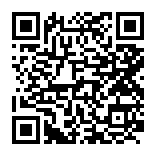
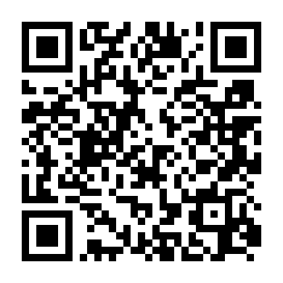
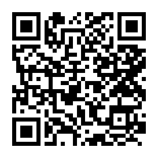
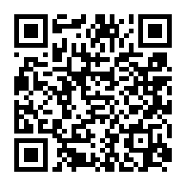

# 🧪 CareLink（ケアリンク）
## 第三者検証用 外部接続・操作テスト手順書
### 〜 外部インターネット接続・4大ポータル動作検証ガイド 〜

本手順書は、介護施設向け統合AI見守りシステム「CareLink（ケアリンク）」の第三者検証（外部評価・動作確認テスト）を行っていただくテスターおよび関係者の皆様向けの公式マニュアルです。

お手持ちのスマートフォン、タブレット、PCから専用の固定URLまたはQRコードを読み取るだけで、施設外のインターネット環境から各ポータル画面の機能と使い勝手を直接ご検証いただけます。

---

## 🌟 １. ケア・リンク（CareLink）の概要

CareLink（ケアリンク）は、**「入居者様の尊厳と笑顔を守り、介護現場の記録・見守り負担を劇的に軽減する」** ことを目指して開発された、介護施設向けの次世代統合AIプラットフォームです。

```text
┌───────────────────────────────────────────────────────────────────────────┐
│                      CareLink 施設内統合AIアーキテクチャ                    │
├─────────────────────┬─────────────────────┬───────────────────────────────┤
│  🏠 居室端末        │  🏥 スタッフ画面    │  👨‍👩‍👧 ご家族ポータル           │
│  ・Gemini音声対話   │  ・緊急SOS/転倒警告 │  ・今日のご様子・健康サマリー │
│  ・昭和レトロ回想法 │  ・生体センサー監視 │  ・AI生成デジタル絵手紙       │
│  ・安心みまもりくん │  ・AI自動日報支援   │  ・直通インターホン通話       │
└──────────┬──────────┴──────────┬──────────┴───────────────┬───────────────┘
           │                     │                          │
           └─────────────────────┼──────────────────────────┘
                                 │
                     💈 訪問理美容師ポータル
                     ・姿勢/認知症の事前注意点
                     ・施術完了の即時共有
```

### 💡 4つの大きな特徴
1. **入居者様の孤独解消と安心（居室端末）**
   - 直感的な大きなボタンと音声対話AI（Gemini Live連携）により、昔の懐かしい想い出（回想法）や日常の話し相手になります。
   - 体調の異変や「助けて」の声を自動検知し、スタッフへ即座に緊急通報します。
2. **介護現場の負担ゼロ化（スタッフステーション）**
   - ミリ波レーダーやスマートウォッチ（Google Fit連携）による生体データを秒単位で統合監視。
   - 入居者様との会話内容やバイタル数値をAIが自動整理し、夕方の申し送りや介護日報ドラフトを自動生成します。
3. **離れて暮らすご家族との温かい絆（ご家族ポータル）**
   - 毎日の体調サマリーに加え、AIが入居者様との会話から自動生成する世界にひとつの「デジタル絵手紙」をスマホにお届けします。ハガキ印刷もワンクリックです。
4. **外部専門スタッフとの安全連携（訪問理美容ポータル）**
   - 施設を訪問する理容師・美容師様が、施術前に「首の角度」「急な体動」「皮膚のデリケートさ」などの注意点をスマホで即座に確認し、事故のない安全な施術を実現します。

---

## 📱 ２. 検証の事前準備・推奨環境

- **推奨ブラウザ**:
  - iPhone / iPad: **Safari** または **Google Chrome**
  - Android / PC: **Google Chrome**（最新版）
- **通信環境**:
  - 一般的なモバイル回線（4G / 5G）またはWi-Fi（ご自宅・オフィス等）
- **マイクの許可**:
  - 居室端末やインターホン通話をテストされる際は、初回アクセス時にブラウザで表示される「マイクの利用」を **「許可」** してください。

---

## 🌐 ３. 外部接続URL・ログイン情報・QRコード一覧

各ポータルの見出しにあるQRコードをお手元のスマートフォン等のカメラで読み取るか、URLをクリックしてアクセスしてください。

### ① 🏥 介護スタッフステーション（施設管理者・介護士用）
施設全体の状況を一目で把握し、緊急アラート対応やバイタル監視、AI自動日報を確認できるPC・iPad向け管理画面です。

| 項目 | 設定内容 | QRコード |
| :--- | :--- | :---: |
| **接続URL** | **`https://k3and4ai-sudo.github.io/Nursing_facility/staff/`** |  |
| **ユーザーID** | `staff01` | |
| **パスワード** | `staff123` | |
| **推奨端末** | PC、iPad、大型タブレット | |

#### 🔍 検証確認ポイント
- [ ] 画面上部の **「🚨 アクティブアラート」** 欄が正常に表示されているか
- [ ] 中段の **「⌚ Google Fit クラウド自動見守り連携」** 状態が確認できるか
- [ ] 左下の **「📋 最近測定されたバイタル情報」** 一覧に心拍数・歩数等が表示されているか
- [ ] 左側サイドバーのメニュー（「利用者マスター」「バイタル分析」「対話・インターホン」「申し送り」等）がスムーズに切り替わるか

---

### ② 💈 訪問理容・美容師ポータル（訪問スタッフ用）
施設へ訪問する理美容師様が、施術前に注意点を確認し、施術完了報告を送信するための専用画面です。

| 項目 | 設定内容 | QRコード |
| :--- | :--- | :---: |
| **接続URL** | **`https://k3and4ai-sudo.github.io/Nursing_facility/barber/`** |  |
| **自動ログイン** | **ログイン入力不要**（アクセスと同時に自動ログイン） | |
| **手動ID/PASS** | ID: `barber01` / PASS: `barber123` | |
| **推奨端末** | スマートフォン、タブレット | |

#### 🔍 検証確認ポイント
- [ ] 本日の予約一覧（入居者様のお名前、お部屋番号、メニュー）が表示されるか
- [ ] 黄色・オレンジ枠の **「⚠️ 姿勢・認知症の注意点」** が大きく読みやすく表示されているか
- [ ] **「施術完了を報告 📝」** ボタンを押し、ご機嫌や頭皮状態の選択・送信ができるか

---

### ③ 👨‍👩‍👧 ご家族見守りポータル（ご家族スマートフォン用）
離れて暮らすご家族が、日々の体調や温かい想い出、AIデジタル絵手紙を閲覧できるスマートフォン・PC向け画面です。

| 項目 | 設定内容 | QRコード |
| :--- | :--- | :---: |
| **接続URL** | **`https://k3and4ai-sudo.github.io/Nursing_facility/`** |  |
| **ユーザーID** | `family01` | |
| **パスワード** | `family123` | |
| **推奨端末** | スマートフォン（縦画面推奨）、ご自宅PC | |

#### 🔍 検証確認ポイント
- [ ] 入居者様の **「健康ステータス」**（体温・血圧・ご機嫌）が表示されるか
- [ ] 温かい水彩風の **「AIデジタル絵手紙」** とメッセージが表示されるか
- [ ] 「ハガキサイズで印刷」や四季の着せ替え、オルゴールBGMの再生ができるか
- [ ] 画面下部の入力欄から入居者様へ「メッセージや写真」を送信できるか

---

### ④ 🏠 居室端末（入居者様・かんたん対話画面）
入居者様のお部屋に置かれるタブレット端末の画面です。超高齢者向けに極限までシンプルに設計されています。

| 項目 | 設定内容 | QRコード |
| :--- | :--- | :---: |
| **接続URL** | **`https://k3and4ai-sudo.github.io/Nursing_facility/user/`** |  |
| **自動ログイン** | 自動接続（山田 太郎 様 101号室） | |
| **推奨端末** | iPad、Androidタブレット、PC | |

#### 🔍 検証確認ポイント
- [ ] まんまるい青い光の **「AIパートナー（ジェミナイさん）」** が表示されるか
- [ ] 大きな **「みどりのおはなしボタン」** を押してお話しできるか（マイク許可時）
- [ ] 困ったときの「🚨 スタッフに連絡」機能が確認できるか

---

## 📋 ４. 第三者検証用 チェックリスト

動作テストの際、以下の項目について「良好・課題あり」をチェックしていただき、フィードバックをお願いいたします。

| 検証項目 | 確認内容 | 判定 | メモ・気づき |
| :--- | :--- | :---: | :--- |
| **接続のスムーズさ** | QRコードまたはURLから5秒以内に画面が表示されたか | [ ] 良好 / [ ] 要改善 | |
| **文字・視認性** | スマートフォン・PCの画面サイズで見やすい文字・配置か | [ ] 良好 / [ ] 要改善 | |
| **操作の直感性** | 迷わずにボタンやメニューを押して目的の情報を確認できたか | [ ] 良好 / [ ] 要改善 | |
| **デザイン・印象** | 医療・介護システムとして清潔感や温かみが感じられるか | [ ] 良好 / [ ] 要改善 | |
| **理美容ポータル** | 施術前の注意点（姿勢・認知症）が目に入りやすいか | [ ] 良好 / [ ] 要改善 | |
| **ご家族ポータル** | 絵手紙や体調情報を見て安心感が得られるか | [ ] 良好 / [ ] 要改善 | |

---

## ❓ ５. トラブルシューティング（繋がらない時）

- **Q. 「トンネルサーバーへの接続に失敗しました」「現在トンネルが停止しています」と出る**
  - ➔ *施設内サーバーまたはトンネルプログラム（`./start_tunnel.sh`）が一時的に停止している可能性があります。テスト実施日時の調整について施設担当者へご連絡ください。*
- **Q. 居室端末や通話テストで「マイクが使用できません」と出る**
  - ➔ *ブラウザのURLバーにある「鍵アイコン（またはサイト設定）」をタップし、「マイクの権限」を「許可」にしてページを再読み込みしてください。*
- **Q. ログインエラー（ID/パスワードが違います）と出る**
  - ➔ *英字の大文字・小文字、余分なスペースが入っていないかご確認ください（半角英数：`staff01` / `staff123` など）。*
