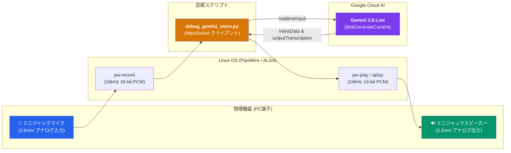

# 🎙️ Gemini 3.8 Live スタンドアロン音声対話テスト手順書
## 〜 PCミニジャックマイク ＆ スピーカー直接検証ガイド 〜

> [!ABSTRACT] **目的**
> ブラウザやWebフロントエンド、各種中継サーバーを介さず、PC本体の**ミニジャックマイク（入力）**と**ミニジャックスピーカー（出力）**が、最新の **Gemini 3.8 Live API (`models/gemini-3.8-live`)** と正しく双方向音声通信できているかを単体で迅速に診断・検証するための手順書です。

---

## 1. テスト環境・前提条件



* **オーディオ入出力**: 
  * 入力 (Source): `Built-in Audio アナログステレオ` (PCミニジャックマイク)
  * 出力 (Sink): `Built-in Audio アナログステレオ` (PCミニジャックスピーカー)
* **テストツール**: [`debug_gemini_voice.py`](file:///media/k3and4/For_AI_Data/Antigravity/TestApp/Nursing_facility/debug_gemini_voice.py)
* **認証**: `.env` 内の `GEMINI_API_KEY` を自動ロード

---

## 2. 基本対話テストの実行手順（ご自身の声でテスト）

端末のターミナルを開き、以下のコマンドを実行します。

```bash
cd /media/k3and4/For_AI_Data/Antigravity/TestApp/Nursing_facility
./debug_gemini_voice.py
```

### 📋 実行の流れと確認ポイント

1. **デバイスの自動認識**:
   * スクリプトが起動すると、PipeWire のデフォルトマイクおよびスピーカーが認識・表示されます。
2. **マイク録音（カウントダウン）**:
   * 画面に「**マイク録音を開始します（4秒間、何か話しかけてください）...**」と表示され、秒数のカウントダウンが始まります。
   * PCのミニジャックマイクに向かって、ハッキリと話しかけてください。
     > **発話例**: 「こんにちは！今日の調子はどうですか？」「ジェミナイさん、聞こえますか？」
3. **波形・RMS音量の自動解析**:
   * 録音完了後、音声サンプルの最大振幅と RMS 音量が表示されます。
   * ※「RMS音量=100以上」であれば、マイクが音声を正常に拾えています。
4. **Gemini 3.8 Live 送信と高速応答**:
   * 音声が WebSocket 経由で Google サーバーへストリーミング送出されます。
   * 約数百ミリ秒（初回音声レイテンシ: 約 700ms）で Gemini 3.8 Live からの日本語返答テキストがターミナルに表示されます。
5. **スピーカーからの音声再生**:
   * 受信した 24kHz PCM 音声が、ミニジャックスピーカーから自動再生されます。

---

## 3. 応用コマンド・オプション一覧

状況に応じて、以下のオプション引数を指定して実行できます。

| 実行コマンド | 用途・説明 |
| :--- | :--- |
| `./debug_gemini_voice.py` | **標準テスト**: 4秒間マイク録音 ➔ 返答音声を再生 |
| `./debug_gemini_voice.py --duration 6` | **秒数変更**: 録音時間を 6秒間 に延長して長めの発話をテスト |
| `./debug_gemini_voice.py --text "こんにちは"` | **スピーカー単体テスト**: マイク録音をスキップし、指定テキストに対するGeminiの返答音声がスピーカーから鳴るか即座に確認 |
| `./debug_gemini_voice.py --check-devices-only` | **機器確認のみ**: 音声通信を行わず、マイク・スピーカーの接続状態のみをコンソールに表示 |

---

## 4. 正常実行時のコンソール出力ログ例

```text
============================================================
  🎙️  Care-Link Gemini 3.8 Live 音声デバッグツール
============================================================
[1] オーディオ入出力デバイスの確認中...
  🎤 デフォルト・マイク入力 (Source): Built-in Audio アナログステレオ (ミニジャック)
  🔊 デフォルト・スピーカー出力 (Sink): Built-in Audio アナログステレオ (ミニジャック)

[2] 🎤 マイク録音を開始します（4.0 秒間、何か話しかけてください）...
    👉 例:「こんにちは！今日の調子はどうですか？」
    ⏺️ 録音中... 残り 1 秒
    ✅ 録音完了！
    📊 録音データ統計: サンプル数=64000 (4.00秒), 最大振幅=18240, RMS音量=4512.3

============================================================
  🎙️  Gemini 3.8 Live 接続テスト: models/gemini-3.8-live
============================================================
[3] 🌐 Gemini 3.8 Live サーバーへ WebSocket 接続中...
    ✅ WebSocket 接続・Setup 成功！
    📤 マイク音声（16kHz PCM）を Gemini 3.8 Live へストリーミング送信中...
    🛎️ 発話終了シグナル (turnComplete) を送信...

    📥 Gemini 3.8 Live からの応答を受信中...
    ⚡ 初回音声受信レイテンシ: 685.2 ms
    💬 [Gemini 3.8 テキスト応答]: こんにちは！とても元気ですよ。
    💬 [Gemini 3.8 テキスト応答]: 今日は何か良いことがありましたか？
    🏁 応答生成完了（合計音声サイズ: 215040 バイト, 約 4.48 秒）

[4] 🔊 スピーカーから Gemini 3.8 Live の返答音声を再生中...
    ✅ 音声再生完了！
```

---

## 5. トラブルシューティング

> [!WARNING] **「RMS音量が非常に小さい（ほぼ無音）」と警告が出る場合**
> 1. **ミニジャック端子の確認**:
>    マイク端子（ピンク色またはマイクマーク）にプラグが奥までしっかり挿入されているかご確認ください。
> 2. **入力ボリュームの確認**:
>    ターミナルで `wpctl status` を実行し、マイク入力の音量をご確認ください。音量を上げる場合は以下を実行します：
>    ```bash
>    wpctl set-volume 54 0.8  # ID 54（アナログマイク）の音量を80%に設定
>    ```

> [!TIP] **スピーカーから音が出ない場合**
> 1. スピーカーの電源スイッチおよび音量ツマミをご確認ください。
> 2. スピーカー出力の音量設定コマンド：
>    ```bash
>    wpctl set-volume 53 0.9  # ID 53（アナログスピーカー）の音量を90%に設定
>    ```
