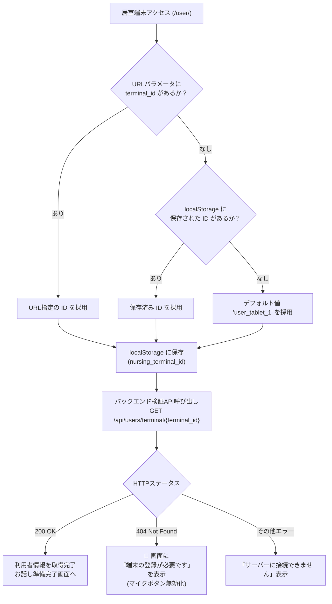
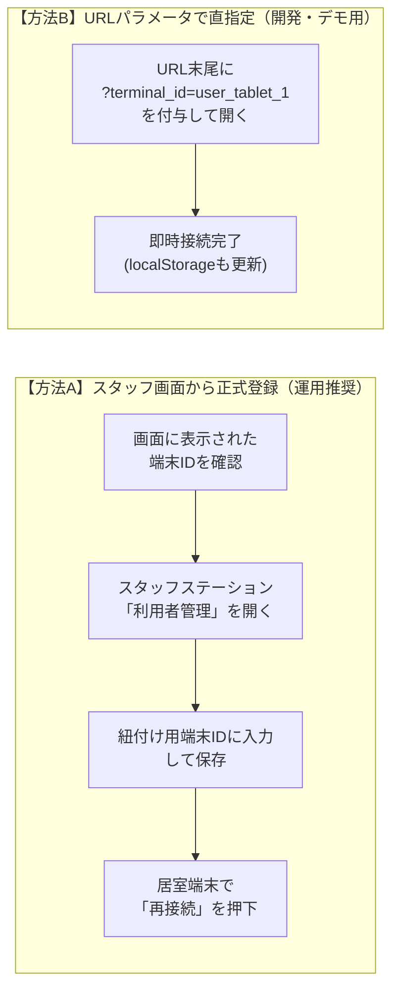

# 📱 居室端末 端末登録と利用者紐付け開発者マニュアル
## 〜 「端末の登録が必要です」表示時の復旧手順とバインディングアーキテクチャ 〜

> [!ABSTRACT] **概要**
> 本ドキュメントは、介護施設向けAI見守りプラットフォーム「ケア・リンク (Care-Link)」において、居室端末（`/user/`）アクセス時に**「端末の登録が必要です」**というモーダルオーバーレイが表示されるメカニズム、スタッフステーションからの利用者紐付け手順、URLパラメータによる即時復旧手法、および内部データ構造（SQLite）について体系的にまとめた開発者・運用者向け技術マニュアルです。

---

## 1. 発生メカニズムとアーキテクチャ

### 1-1. 居室端末の端末ID（`terminal_id`）解決フロー
居室端末クライアント（[`frontend/user/app.js`](file:///media/k3and4/For_AI_Data/Antigravity/TestApp/Nursing_facility/frontend/user/app.js)）は、起動時に以下の優先順位で自端末の `terminal_id` を確定します。



### 1-2. 「端末の登録が必要です」が表示される根本原因
- バックエンドの `GET /api/users/terminal/{terminal_id}` に対し、データベース（SQLite）の `users` テーブル内で **該当する `terminal_id` を保持する利用者が存在しない場合、HTTP 404 が返却** されます。
- クライアントは 404 を受け取ると、誤認操作や未登録端末による誤作動を防ぐため、音声マイクやAI機能をロックし、全画面の登録案内モーダル（`#register-overlay`）を表示します。

```html
<!-- frontend/user/index.html 内の登録要求モーダル -->
<div id="register-overlay" class="modal-overlay">
    <div class="modal-card">
        <h2>端末の登録が必要です</h2>
        <p>この端末はまだ利用者に紐付けられていません。</p>
        <div class="terminal-id-box">
            <span>この端末のID:</span>
            <strong id="display-terminal-id">user_tablet_xxxx</strong>
        </div>
        <p class="instruction">スタッフステーション画面で、このIDを新しい利用者に登録してください。</p>
        <button id="retry-btn" class="modal-btn">再接続</button>
    </div>
</div>
```

---

## 2. 登録・復旧手順（2つのアプローチ）

運用環境や用途（本番登録か、開発・デモ確認か）に応じて以下のいずれかで対応します。



### 方法A：スタッフステーション画面から紐付ける（正規の運用手順）

1. **画面上の端末IDを確認する**:
   - 居室端末のモーダル中央にある **「この端末のID: （例: `user_tablet_3126`）」** を確認・メモします。
2. **スタッフステーション（管理画面）を開く**:
   - URL: [`http://localhost:8000/staff/`](http://localhost:8000/staff/) （トンネル環境時は `https://<トンネルドメイン>/staff/`）
   - スタッフアカウントでログイン（ID: `staff01` / パスワード: `staff123`）
3. **「利用者管理」タブを選択する**:
   - 左側サイドバーから「利用者管理」を開きます。
4. **端末IDを入力して保存する**:
   - **既存の利用者に割り当てる場合**:
     - 一覧から対象の利用者（例: 山田 太郎 様）をクリックして編集フォームを開きます。
     - **「紐付け用端末ID (1対1) *」** の入力欄に、先ほど確認した端末IDを入力します。
     - 「保存」ボタンをクリックします。
   - **新規の利用者に割り当てる場合**:
     - 氏名・年齢・居室番号を入力し、**「紐付け用端末ID (1対1) *」** に該当IDを入力して「登録」をクリックします。
5. **居室端末で「再接続」ボタンを押す**:
   - 居室端末画面の **「再接続」** ボタンを押すか、ブラウザをリロード（F5）します。
   - 紐付けが完了し、`◯◯号室 ◯◯様` のバッジとともに「お話しする準備ができました」と表示されます。

---

### 方法B：URLパラメータで登録済み端末IDを指定する（手軽なデモ・検証用）

データベースに初期登録されている端末ID（例: `user_tablet_1`）をURLクエリパラメータに明示してアクセスします。

- **ローカル環境**:
  ```text
  http://localhost:8000/user/?terminal_id=user_tablet_1
  ```
- **トンネル環境（Cloudflare / GitHub Pages経由）**:
  ```text
  https://<ドメイン>/user/?terminal_id=user_tablet_1
  ```

> [!TIP]
> パラメータ付きURLで1度でもアクセスすると、ブラウザの `localStorage`（キー: `nursing_terminal_id`）に保存されるため、次回以降はパラメータ無しの `/user/` にアクセスしても自動的にその端末IDで接続されます。

---

## 3. データベース仕様と初期登録ユーザー

### 3-1. `users` テーブル定義 (SQLite: `backend/database.py`)
システム内では、利用者の個人情報と端末IDが 1対1（UNIQUE制約）で紐付けられています。

| カラム名 | 型 | 説明 |
| :--- | :--- | :--- |
| `id` | INTEGER | 主キー (Auto Increment) |
| `name` | TEXT | 利用者氏名 (暗号化保存) |
| `room_number` | TEXT | 居室番号 (例: "101", "104") |
| `terminal_id` | TEXT | **紐付け用端末ID (UNIQUE)** |
| `dementia_level` | TEXT | 認知症レベル (`none`, `mild`, `moderate`, `severe`) |
| `attention_notes` | TEXT | 対話時の注意点 (暗号化保存) |
| `gemini_api_key` | TEXT | 利用者専用 Gemini APIキー (任意) |

### 3-2. デモ環境における初期登録端末一覧
初期シードデータ（またはテストデータ）として以下の端末IDが登録されています。

| 利用者氏名 | 居室番号 | 登録済み端末ID (`terminal_id`) |
| :--- | :--- | :--- |
| 山田 太郎 様 | 101号室 | `user_tablet_1` |
| 山田 二郎 様 | 102号室 | `user_tablet_2` |
| 山田 三郎 様 | 103号室 | `user_tablet_3` |
| Yamada Taro 様（予備） | 105号室 | `user_tablet_3126` |

### 3-3. CLI からの登録確認・修復コマンド
ターミナルから直接、現在の登録状況の確認や端末IDの書き換えを行うことができます。

```bash
# 登録済みユーザーと端末IDの一覧確認
python3 -c "from backend import database as db; print([(u['id'], u['name'], u['terminal_id'], u['room_number']) for u in db.get_all_users()])"

# 端末IDの強制更新例 (ユーザーID: 1 の端末IDを user_tablet_demo に変更)
python3 -c "from backend import database as db; db.update_user(user_id=1, terminal_id='user_tablet_demo')"
```

---

## 4. 開発者向けデバッグモード（Debug Mode）の仕様

開発・検証を円滑に行うため、フロントエンドには以下のデバッグ機能が組み込まれています。

1. **未登録端末の自動フォールバック**:
   - デバッグモードが有効（`?debug=true` または画面上で `DB` キー押下）の場合、未登録の端末IDでアクセスして 404 になっても、自動的に `user_tablet_1` に切り替えて再接続を試みる設計になっています（[`app.js:606-613`](file:///media/k3and4/For_AI_Data/Antigravity/TestApp/Nursing_facility/frontend/user/app.js#L606-L613)）。
2. **キーボードショートカット**:
   - 画面上でキーボードから `D` `B` と連続入力することで、デバッグUIおよびデバッグログの表示/非表示を切り替えられます。

---

## 5. トラブルシューティング FAQ

### Q1. スタッフ画面で保存したのに「端末の登録が必要です」が消えない
- **確認事項**:
  1. 居室端末画面の **「この端末のID:」** に表示されている文字列と、スタッフ画面で入力した文字列に大文字・小文字・余分なスペースなどの不一致がないか確認してください。
  2. 保存後、居室端末で **「再接続」** ボタンを押すか、ブラウザの完全再読み込み（Ctrl + Shift + R または Cmd + Shift + R）を実行してください。

### Q2. 居室端末のブラウザキャッシュ・保存されたIDをリセットしたい
- **手順**:
  - ブラウザの開発者ツール（F12）の「Console」タブを開き、以下を実行してリロードします:
    ```javascript
    localStorage.removeItem("nursing_terminal_id");
    location.reload();
    ```

### Q3. 「端末IDが重複しています」というエラーがスタッフ画面で出る
- **原因**:
  - ケア・リンクでは、居室タブレットと利用者は **1対1対応** を厳密に維持するため、`terminal_id` はシステム内でユニークである必要があります。
- **対処法**:
  - 既に他の利用者に同じ端末IDが割り当てられていないか確認し、重複している側の端末IDを変更するか、既存利用者の端末IDを更新してください。

---

*発行: ケア・リンク (Care-Link) システム開発・運用チーム*  
*改定日: 2026年9月22日*
