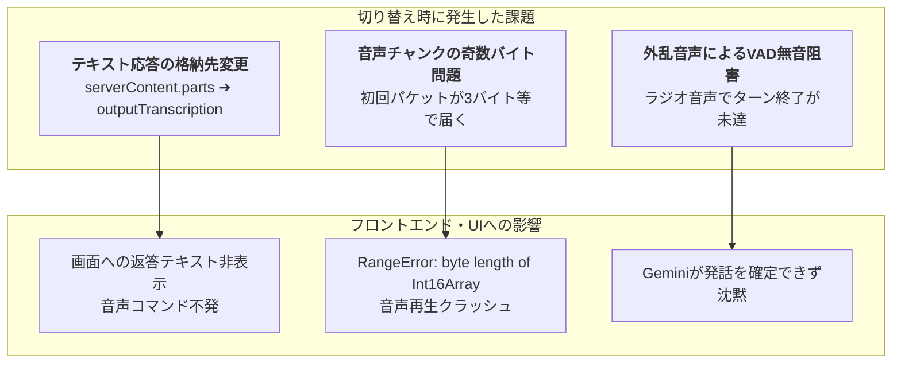
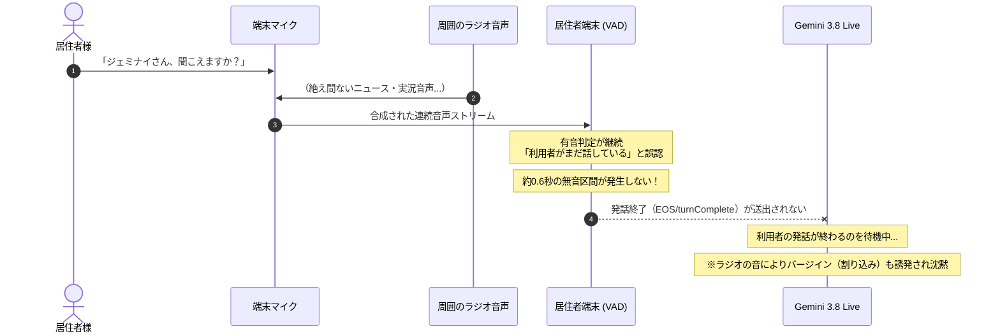
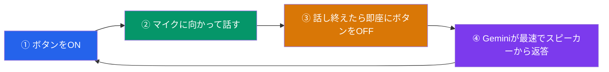

# 🎙️ ケア・リンク (Care-Link) 技術知見録
## 〜 Gemini 3.8 Live 音声対話トラブルシューティング ＆ 外乱環境（テレビ・ラジオ）運用設計 〜

> [!ABSTRACT] **概要**
> 本ドキュメントは、介護施設向けAI見守りプラットフォーム「ケア・リンク」において、音声対話エンジンを最新の **Gemini 3.8 Live (`gemini-3.8-live`)** に更新した際に発生した「音声発声停止事象」の根本原因分析、ブラウザリロード時のリセット境界、およびラジオ・テレビ等の外乱環境における最適な音声運用設計（プッシュ・トゥ・トーク）を体系的にまとめた技術・運用知見録です。

---

## 1. 発生事象と根本原因の解析

### 1-1. Gemini 3.8 Live 切り替えに伴う発声停止の要因
Gemini 2.5 から 3.8 Live への世代交代に伴い、以下の API 仕様差分およびオーディオ境界の不整合が発生していました。

1. **テキスト出力フィールドの仕様変更**:
   - 従来の 2.5 Flash では `serverContent.modelTurn.parts[].text` にテキストが返却されていましたが、**Gemini 3.8 Live では `serverContent.outputTranscription.text` という別フィールドに格納**されるようプロトコルが改定されていました。
   - これにより、画面への返答テキスト表示、会話ログ保存、および音声制御コマンド（画面切替・記録停止）が未トリガーとなっていました。
2. **音声チャンクのバイト境界（`RangeError`）**:
   - Google サーバーから配信される初回 24kHz PCM 音声チャンクに **奇数バイト（例: 3バイトなど）** が含まれる場合があり、ブラウザ側の `new Int16Array(buffer)` 実行時に `RangeError: byte length of Int16Array should be a multiple of 2` がスローされ、再生処理が中断されていました。
3. **無音検出（VAD）と発話終了シグナル**:
   - 純粋な音声ストリームだけでは発話終了判定が遅延・不発になる場合があり、明示的な `turnComplete: true`（EOS）が届くまで発声を開始しないケースがありました。

---

## 2. 外乱音声（ラジオ・テレビ）による「沈黙フリーズ」のメカニズム

居住者端末の近傍でラジオやテレビが鳴っている際、AIが返答しなくなる現象の物理的・論理的メカニズムは以下の通りです。

* **VAD（Voice Activity Detection）の継続判定**:
  マイクが拾った音声エネルギーがノイズゲートしきい値を超え続けるため、システムは「利用者が途切れず話し続けている」と判断し、発話確定（EOS）フレームを送信できません。
* **バージイン（話者割り込み）の自己抑制**:
  Gemini Live は相手が話し始めると自分の発声を瞬時にフェードアウトして聞き役に回る設計（全二重対話）のため、ラジオの音を「人間の声」と認識して発声を控えてしまいます。

---

## 3. 「画面リロード」と「トークボタン On/Off」の詳細比較

トラブル発生時や運用時の切り分けとして、両者の内部挙動の違いは以下の通りです。

| 比較項目 | 🎙️ トークボタンの On/Off | 🔄 画面リロード（F5・更新） |
| :--- | :--- | :--- |
| **操作目的** | **日常的な外乱遮断・会話の一時停止** | **通信エラー・異常時の万能復旧** |
| **復帰速度** | **最速（瞬時に再開可能 ⚡）** | 2〜4秒（ページ再読込＋再接続待ち ⏳） |
| **Gemini Live 接続** | **切断せず維持**（セッション維持） | **物理的に切断 ➔ 新規セッション再生成** |
| **マイク入力** | 物理停止 ➔ 再開（余計な音を遮断） | 完全破棄 ➔ 初期化（OFFに戻る） |
| **滞留オーディオバッファ** | 即時フラッシュ・クリア 🧹 | 物理的に全消滅 🧹 |
| **会話の記憶（履歴）** | **完全維持（100%継続）** | **直近6往復のみDBから再注入** |
| **画面・動作モード** | そのまま維持（内緒話モードも継続） | 初期状態に復帰（通常モードへリセット） |

> [!NOTE] **リロード時の記憶引き継ぎメカニズム**
> 画面をリロードすると Gemini Live の生 WebSocket セッションは破棄されますが、バックエンド DB（`nursing_facility.db`）に保存されている**直近6ターン（往復）の会話文脈**が、再接続時に自動的に `systemInstruction` に再注入されます。そのため、リロード後も直前の会話内容を踏まえて対話を継続できます。

---

## 4. 騒音・外乱環境下における運用ベストプラクティス

### 💡 プッシュ・トゥ・トーク（トランシーバー型運用）の推奨
ラジオ・テレビが点いている環境や、デイサービス・食堂など周囲の生活音・話し声が大きい環境では、**「話す時にボタンをON、話し終えたらOFFにする」** 運用が最も堅牢です。

1. **外乱の物理遮断**:
   発話していない時間はマイクが完全に遮断されるため、ラジオの音を Gemini が拾う余地がゼロになります。
2. **エコー・ハウリング・自己割り込みの完全防止**:
   Gemini がスピーカーから音声を出力している間はマイクが確実に閉じており、AIが自分の声を拾って返答を止めてしまうトラブルが完全に防げます。
3. **待ち時間ゼロの即時応答（プログラム改善済）**:
   今回の改修により、**ボタンをOFFにした瞬間に「発話確定シグナル（EOS）」が Gemini Live へ直ちに送出**されます。無音判定（0.6秒）を待つことなく、ボタンOFFと同時に最速で返答音声が流れます。

---

## 5. 実施されたプログラム改修まとめ

### (1) バックエンド: [`backend/gemini_live.py`](file:///media/k3and4/For_AI_Data/Antigravity/TestApp/Nursing_facility/backend/gemini_live.py)
* **`outputTranscription` 受信ハンドラーの実装**:
  `serverContent.outputTranscription.text` から返答テキストを抽出し、UI表示・会話履歴・コマンド判定へ連携。
* **音声主導ターンの発話確定保証**:
  ブラウザ側テキスト認識が遅れた場合でも、`send_end_of_turn()` 内で `turnComplete: true` を Gemini Live へ確実に送信。

### (2) フロントエンド: [`frontend/user/app.js`](file:///media/k3and4/For_AI_Data/Antigravity/TestApp/Nursing_facility/frontend/user/app.js)
* **2バイト境界アライメント保護（`RangeError` 防止）**:
  受信した 24kHz PCM チャンクの端数奇数バイトを内部バッファ（`pcmChunkRemainder`）に繰り越し、必ず偶数バイト長で `Int16Array` を生成。
* **マイクボタン手動OFF時の即時EOS送信**:
  ボタンをOFFにしたトリガーで `type: "eos"` を WebSocket 送信し、プッシュ・トゥ・トーク運用時の超高速レスポンスを実現。

---

## 6. 現場運用クイックリファレンス

* **平常時（静かな居室）**:
  * トークボタンを1回押してONのままにし、自然な対面ハンズフリー会話をお楽しみください。
* **テレビ・ラジオ視聴中 / 賑やかなフロア**:
  * トークボタンを**「話す直前にON ➔ 話し終わったらすぐOFF」** にしてください。
* **万が一返答が止まった場合**:
  * まずはトークボタンを **「1回押してOFF ➔ もう1回押してON」**。
  * それでも復帰しない場合は **「ブラウザの更新（リロード）」** を行ってください。
