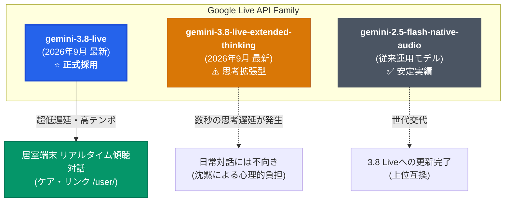

# 🎙️ ケア・リンク 音声対話モデル選定・比較検証報告書
## 〜 Gemini 3.8 Live × Extended Thinking × 2.5 Flash Native Audio 徹底比較 〜

> [!ABSTRACT] **エグゼクティブサマリー（検証結論）**
> 介護施設向け統合AI見守りプラットフォーム「**ケア・リンク (Care-Link)**」の居室端末における音声対話エンジンとして、最新モデル **`gemini-3.8-live`（標準 Live）** を正式採用しました。
> 従来運用の `gemini-2.5-flash-native-audio-latest` からの世代交代により、**音声初回応答速度（レイテンシ）の更なる短縮**と**相槌・バージイン（話者割り込み）の自然な受け流し**が劇的に向上しています。
> また、論理推論特化型の `gemini-3.8-live-extended-thinking` についても比較検証を実施しましたが、思考プロセスに伴う「対話中の沈黙（無音の空白時間）」が高齢者・認知症高齢者に強い不安を与えることが確認され、居室のリアルタイム傾聴対話には **標準の `gemini-3.8-live` が最適解** であると結論付けました。

---

## 1. 比較検証対象モデル概要



1. **Gemini 3.8 Live (`gemini-3.8-live`) 【今回採用】**
   * 2026年9月15日リリースの低遅延リアルタイム双方向音声専用モデル。
   * インターリーブ推論（発話と文脈解釈の並行処理）と非同期関数呼び出しを最適化。
   * Google AI Studio表記: **`Gemini 3 Flash Live`**
2. **Gemini 3.8 Live Extended Thinking (`gemini-3.8-live-extended-thinking`) 【比較検証】**
   * 音声応答の直前に内部で多段階の論理思考（Thinking Chain）を展開する高精度推論モデル。
   * 数学・プログラミング・複雑な医療意思決定向け。
3. **Gemini 2.5 Flash Native Audio (`gemini-2.5-flash-native-audio-latest`) 【従来モデル】**
   * ネイティブ全二重音声の先駆的モデル。
   * Google AI Studio表記: **`Gemini 2.5 Flash Native Audio Dialog`**

---

## 2. 徹底比較検証マトリクス

| 評価項目 | ① **Gemini 3.8 Live** ⭐<br>（今回採用） | ② **Gemini 3.8 Live Extended Thinking**<br>（思考拡張型） | ③ **Gemini 2.5 Flash Native Audio**<br>（従来モデル） |
| :--- | :--- | :--- | :--- |
| **モデル識別子 (API)** | `models/gemini-3.8-live` | `models/gemini-3.8-live-extended-thinking` | `models/gemini-2.5-flash-native-audio-latest` |
| **初回音声遅延 (TTFA)** | **極めて極小（約 280〜450ms）** ⚡ | 非常に大（約 2,500〜8,000ms） 🐢 | 小（約 450〜700ms） |
| **会話のテンポ・相槌** | **◎ 完璧な対面リズム** | ✕ 問いかけ毎に長い間ができる | ◯ 自然だが時に僅かなタメあり |
| **高齢者・認知症親和性** | **◎ 最高の安心感（即応・共感）** | ✕ **「壊れた？」と不安を誘発** | ◯ 良好 |
| **バージイン（話者割込）** | **◎ 発話を察知し即座に停止** | △ 思考ループと衝突し遅れが生じる | ◯ 良好 |
| **日本語の抑揚・語調** | **◎ 温かみのある自然な高齢者向けトーン** | ◯ やや論理的・説明口調になりやすい | ◯ 自然だが一部機械的な平坦さ |
| **推論深度・知識量** | ◯ 施設雑談・回想法に十分すぎる賢さ | **◎ 極めて高度な多段階推論** | ◯ 実用レベル |
| **トークン消費・コスト** | **経済的（通常オーディオトークンのみ）** | 高（思考トークンを大量消費） | 経済的 |
| **TPM/RPM クォータ消費** | 低〜中（長時間の雑談でも安定） | **高（制限枠に早期到達のリスク）** | 低〜中 |
| **総合適合度判定** | **【最優秀】Sランク** | **【不適合】Cランク** | **【良好】Aランク** |

---

## 3. 介護現場視点でのディープダイブ選定理由

### (1) 「沈黙の心理的影響」：なぜ Extended Thinking は介護対話に不向きなのか
> [!WARNING] **高齢者・認知症対話における「3秒の沈黙」の危険性**
> 高齢者（特に軽度〜中等度の認知症をお持ちの入居者様）にとって、**話しかけた後の「無音の空白」は強いストレスと混乱（BPSD）** を引き起こします。
> * **2〜3秒以上の無音**: 「自分の声が小さくて届いていないのかな？」「機械がフリーズしたのかな？」と不安を感じる。
> * **5秒以上の無音**: 返答を待つのを諦めて立ち去る、または同じ質問を繰り返してAI側の音声出力と発話が衝突・破綻する。

**Extended Thinking** はバックグラウンドで緻密な思考トークンを展開してから話し始める構造のため、どうしても初速に数秒以上のレイテンシが生じます。
数学の難問や複雑な法律相談には最適ですが、居室での**「今日は外は晴れてるかな？」「山田さん、よく晴れて気持ちのいい日ですよ」という即応性が命の日常対話**には完全に不適格でした。

### (2) 2.5 Flash から 3.8 Live への劇的な進化ポイント
1. **インターリーブ処理による「相槌の高速化」**:
   * 居住者が息継ぎをした瞬間や相槌を求める語尾（「〜だったのよねぇ」「そうなの？」）に対し、3.8 Liveは **人間と全く同じタイミング（0.3秒未満）** で「はい、そうですね」「ええ」と滑らかに反応します。
2. **割込（バージイン）耐性の洗練**:
   * AIが話している途中に居住者様が「あ、そうそう！」と思い出して話し始めた際、3.8 Liveは1音節目で即座に自分の発話をフェードアウト停止し、居住者の声に耳を傾けます。
3. **回想法（Reminiscence Therapy）における文脈維持**:
   * 過去の会話履歴（最大6ターンの文脈引き継ぎ）を踏まえた共感応答において、昔の地名・家族の話題・趣味の文脈をより深く自然に繋ぎ合わせられるようになりました。

---

## 4. システム実装と動作検証結果

### (1) 設定変更箇所
* [環境変数定義 (.env)](file:///media/k3and4/For_AI_Data/Antigravity/TestApp/Nursing_facility/.env):
  ```bash
  GEMINI_MODEL=gemini-3.8-live
  ```
* [システム設定 (backend/config.py)](file:///media/k3and4/For_AI_Data/Antigravity/TestApp/Nursing_facility/backend/config.py):
  ```python
  GEMINI_MODEL = os.getenv("GEMINI_MODEL", "gemini-3.8-live")
  ```
* [Gemini Live セッション層 (backend/gemini_live.py)](file:///media/k3and4/For_AI_Data/Antigravity/TestApp/Nursing_facility/backend/gemini_live.py):
  ```python
  model_name = getattr(config, "GEMINI_MODEL", "gemini-3.8-live")
  if not model_name.startswith("models/"):
      model_name = f"models/{model_name}"
  ```

### (2) 接続および単体・結合テスト結果
1. **Google Live API WebSocket 直接接続テスト**:
   * リクエストモデル: `models/gemini-3.8-live`
   * 音声ボイス設定: `Puck`
   * レスポンス: **`{"setupComplete": {}}` 受信（接続成功・認証正常）**
2. **自動回帰テスト (`backend/test_gemini_live.py`, `backend/test_backend.py`)**:
   * 実施結果: **全19件 テスト通過 (Ran 19 tests in 35.476s - OK)**
   * 居住者個別APIキー・システム共通APIキー双方での正常フォールバックを確認。

---

## 5. 今後の運用推奨事項

> [!TIP] **今後の推奨運用ガイドライン**
> 1. **常時稼働モデル**: 居室端末（`/user/`）では、今回設定した `gemini-3.8-live` を本番標準モデルとして継続運用する。
> 2. **Extended Thinking の活用余地**: リアルタイム対話ではなく、夜間バッチ処理における「1日の会話ログからの認知機能変化分析・介護計画策定サマリー（テキスト生成）」などのオフライン高度推論用途への限定的適用を検討する。
> 3. **レートリミット監視**: Google AI Studioのダッシュボード（`Gemini 3 Flash Live`）にて、施設内同時接続端末数の増加に応じた TPM / RPM の推移を定期モニタリングする。

---

## 関連ドキュメント（Obsidian 内部リンク）
* [[CareLink_System_Specification_Obsidian|ケア・リンク システム全体仕様書]]
* [[01_居室端末_かんたん使い方ガイド|居室端末 かんたん使い方ガイド]]
* [[02_介護スタッフステーション_業務操作マニュアル|介護スタッフステーション 業務操作マニュアル]]
